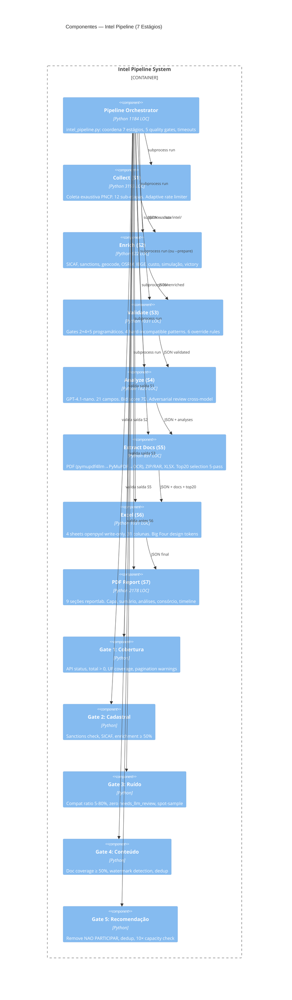

# C4 Componentes (Nível 3) — Extra Consultoria

> Gerado pelo Architect em 2026-07-11T22:00:00Z
> doc_level: completo

## Componentes do Crawl System

```mermaid
C4Component
    title Componentes — Crawl Multi-Source

    Container_Boundary(crawl, "Crawl System") {
        Component(monitor, "Monitor (legado)", "Python", "Orquestrador: loop sobre sources, coordena pipeline")
        Component(orchestrator, "Orchestrator v2", "Python", "Refactor SRP: checkpoint TD-5.2, matching externo")
        Component(pncp, "PNCP Adapter", "Python", "Crawler principal: PNCP API, day-by-day chunks, filtro engenharia")
        Component(dom_sc, "DOM-SC Crawler", "Python", "Diário Municipal: 3 categorias, Basic Auth")
        Component(doe_sc, "DOE-SC Crawler", "Python", "Diário Estadual: Bearer token, categorias, extração regex CNPJ")
        Component(pcp, "PCP Crawler", "Python", "PCP v2 API: fuzzy modalidade mapping, inferência esfera")
        Component(compras_gov, "ComprasGov Crawler", "Python", "2 endpoints: legado + Lei 14.133, auto-detecção")
        Component(contracts, "Contracts Crawler", "Python", "PNCP contratos: janelas 90 dias, inferência UF por CNPJ")
        Component(tce_sc, "TCE-SC Crawler", "Python", "SCMWeb: licitações + contratos, 2 fases coleta")
        Component(sc_compras, "SC Compras Crawler", "Python", "HTML scraping: regex table extraction, detail pages")
        Component(transparencia, "Transparência Crawler", "Python", "4 templates: Betha/Ipam/E-gov/Genérico, BeautifulSoup")
        Component(templates, "Templates (4)", "Python", "Betha (80 mun), Ipam (50), E-gov (40), Genérico (fallback)")

        Component(common, "Common Utils", "Python", "digits_only, safe_float, parse_date, generate_content_hash")
        Component(checkpoint, "Checkpoint", "Python", "Sync (psycopg2) + Async (Supabase), resume support")
        Component(security, "Security", "Python", "USER_AGENT, sanitize_url_param, make_url")
        Component(enricher, "Enricher", "Python", "3 jobs ARQ: entities, municipios, ibge_codes")
        Component(transformer, "Transformer", "Python", "compute_content_hash SHA-256, transform_pncp_item")
        Component(loader, "Loader", "Python", "bulk_upsert, embedding opcional (text-embedding-3-small)")
        Component(circuit_breaker, "Circuit Breaker", "Python", "PNCP + Redis. 5 singletons. Degraded mode")
        Component(sanctions, "Sanctions Checker", "Python", "CEIS+CNEP async. Cache 24h TTL. Rate limit 90/min")
        Component(retry, "Retry Logic", "Python", "validate_timeout_chain, calculate_delay exponential")
    }

    Rel(monitor, pncp, "load_crawler('pncp')")
    Rel(monitor, dom_sc, "load_crawler('dom_sc')")
    Rel(monitor, pcp, "load_crawler('pcp')")
    Rel(monitor, compras_gov, "load_crawler('compras_gov')")
    Rel(monitor, contracts, "load_crawler('contracts')")
    Rel(monitor, tce_sc, "load_crawler('tce_sc')")
    Rel(monitor, sc_compras, "load_crawler('sc_compras')")
    Rel(monitor, transparencia, "load_crawler('transparencia')")

    Rel(orchestrator, pncp, "load_crawler('pncp')")
    Rel(orchestrator, dom_sc, "load_crawler('dom_sc')")
    Rel(orchestrator, doe_sc, "load_crawler('doe_sc') NEW")

    Rel(transparencia, templates, "detect_platform → get_template")

    Rel(pncp, common, "import")
    Rel(dom_sc, common, "import")
    Rel(doe_sc, common, "import")
    Rel(pcp, common, "import")
    Rel(pncp, security, "USER_AGENT + sanitize")
    Rel(pncp, retry, "import")
    Rel(pncp, circuit_breaker, "rate limit check")

    UpdateLayoutConfig($c4ShapeInRow="3", $c4BoundaryInRow="1")
```

## Componentes do Intel Pipeline

```mermaid
C4Component
    title Componentes — Intel Pipeline (7 Estágios)

    Container_Boundary(intel, "Intel Pipeline System") {
        Component(pipeline, "Pipeline Orchestrator", "Python 1184 LOC", "intel_pipeline.py: coordena 7 estágios, 5 quality gates, timeouts")
        Component(collect, "Collect (S1)", "Python 3193 LOC", "Coleta exaustiva PNCP. 12 sub-etapas. Adaptive rate limiter")
        Component(enrich, "Enrich (S2)", "Python 622 LOC", "SICAF, sanctions, geocode, OSRM, IBGE, custo, simulação, victory")
        Component(validate, "Validate (S3)", "Python 1031 LOC", "Gates 2+4+5 programáticos. 4 hard-incompatible patterns. 6 override rules")
        Component(analyze, "Analyze (S4)", "Python 1820 LOC", "GPT-4.1-nano. 21 campos. Bid score 7D. Adversarial review cross-model")
        Component(extract, "Extract Docs (S5)", "Python 897 LOC", "PDF (pymupdf4llm→PyMuPDF→OCR), ZIP/RAR, XLSX. Top20 selection 5-pass")
        Component(excel, "Excel (S6)", "Python 1031 LOC", "4 sheets openpyxl write-only. 31 colunas. Big Four design tokens")
        Component(report, "PDF Report (S7)", "Python 2178 LOC", "9 seções reportlab. Capa, sumário, análises, consórcio, timeline")

        Component(gate1, "Gate 1: Cobertura", "Python", "API status, total > 0, UF coverage, pagination warnings")
        Component(gate2, "Gate 2: Cadastral", "Python", "Sanctions check, SICAF, enrichment ≥ 50%")
        Component(gate3, "Gate 3: Ruído", "Python", "Compat ratio 5-80%, zero needs_llm_review, spot-sample")
        Component(gate4, "Gate 4: Conteúdo", "Python", "Doc coverage ≥ 50%, watermark detection, dedup")
        Component(gate5, "Gate 5: Recomendação", "Python", "Remove NAO PARTICIPAR, dedup, 10× capacity check")
    }

    Rel(pipeline, collect, "subprocess run")
    Rel(pipeline, gate1, "valida saída S1")
    Rel(pipeline, enrich, "subprocess run")
    Rel(pipeline, gate2, "valida saída S2")
    Rel(pipeline, validate, "subprocess run")
    Rel(pipeline, gate3, "valida saída S3")
    Rel(pipeline, analyze, "subprocess run (ou --prepare)")
    Rel(pipeline, extract, "subprocess run")
    Rel(pipeline, gate4, "valida saída S5")
    Rel(pipeline, excel, "subprocess run")
    Rel(pipeline, gate5, "valida antes S6")
    Rel(pipeline, report, "subprocess run")

    Rel(collect, enrich, "JSON → data/intel/")
    Rel(enrich, validate, "JSON enriched")
    Rel(validate, analyze, "JSON validated")
    Rel(analyze, extract, "JSON + analyses")
    Rel(extract, excel, "JSON + docs + top20")
    Rel(excel, report, "JSON final")

    UpdateLayoutConfig($c4ShapeInRow="3", $c4BoundaryInRow="1")
```
