# C4 Componentes (Nível 3) — Extra Consultoria

> Gerado pelo Architect em 2026-07-11T15:00:00Z
> 🟢 CONFIRMADO — baseado em code-analysis.md, modules.json, código-fonte

---

## Container: Python CLI Scripts

```mermaid
C4Component
    Container_Boundary(cli, "Python CLI Scripts") {
        Component(monitor, "monitor.py", "Python 3.12", "Orquestrador multi-source. Pipeline: Crawl → Transform → Upsert → Entity Match → Coverage Update")
        Component(pncp_adapter, "pncp_crawler_adapter.py", "Python 3.12", "Adapter PNCP API. Chunking 1-dia, filtro keywords engenharia, delay anti-429")
        Component(dom_sc, "dom_sc_crawler.py", "Python 3.12", "DOM-SC: 3 categorias (contratos, convênios, empenhos). ~280 municípios")
        Component(pcp_crawler, "pcp_crawler.py", "Python 3.12", "PCP v2: 100+ municípios. Name-only matching (sem CNPJ)")
        Component(compras_gov, "compras_gov_crawler.py", "Python 3.12", "ComprasGov v3: órgãos federais SC")
        Component(tce_sc, "tce_sc_crawler.py", "Python 3.12", "TCE-SC via SCMWeb JSON API. 365 dias full, 7 dias inc")
        Component(transparencia, "transparencia_crawler.py", "Python 3.12", "Gap-fill: detecta Betha/Ipam/E-gov. Template-driven")
        Component(transformer, "transformer.py", "Python 3.12", "Normalização multi-source → schema unificado. Content hash dedup")
        Component(enricher, "enricher.py", "Python 3.12", "BrasilAPI CNPJ + IBGE. Async com semáforo(10). TTL 30 dias")
        Component(intel_pipeline, "intel_pipeline.py", "Python 3.12", "Pipeline 7 stages com 5 quality gates. Orquestrador central")
        Component(intel_collect, "intel_collect.py", "Python 3.12", "Coleta PNCP + DataLake para 1 CNPJ")
        Component(intel_llm, "intel_llm_gate.py", "Python 3.12", "Gate LLM: classificação binária (SIM/NAO). Zero-noise: REJECT on fail")
        Component(intel_analyze, "intel_analyze.py", "Python 3.12", "Análise 5 dimensões: HAB, FIN, GEO, PRAZO, COMP")
        Component(panorama, "panorama.py", "Python 3.12", "Relatório panorama setorial. Terminal + Excel + PDF")
        Component(name_norm, "name_normalizer.py", "Python 3.12", "Normalização PT-BR: 7-step pipeline, 18 abreviações")
        Component(bid_sim, "bid_simulator.py", "Python 3.12", "Lance ótimo: max P(win)×margin. HHI, margens setoriais")
        Component(victory, "victory_profile.py", "Python 3.12", "Perfil de vitória: aprendizado estatístico de contratos ganhos")
        Component(pdf_gen, "intel_report.py", "Python 3.12", "PDF Big Four via ReportLab")
        Component(excel_gen, "intel_excel.py", "Python 3.12", "Excel estilizado via openpyxl")
    }

    ContainerDb(db, "PostgreSQL 17", "PostgreSQL", "DataLake: 8 tabelas, 3 RPCs, 1 view, FTS PT-BR")

    Rel(monitor, pncp_adapter, "Importa e chama crawl()/transform()", "Python import")
    Rel(monitor, dom_sc, "Importa e chama", "Python import")
    Rel(monitor, pcp_crawler, "Importa e chama", "Python import")
    Rel(monitor, compras_gov, "Importa e chama", "Python import")
    Rel(monitor, tce_sc, "Importa e chama", "Python import")
    Rel(monitor, transparencia, "Importa e chama", "Python import")
    Rel(monitor, transformer, "Transforma dados brutos → schema", "Python function call")
    Rel(monitor, name_norm, "Normaliza nomes para matching", "Python function call")
    Rel(monitor, db, "UPSERT + SELECT + coverage queries", "psycopg2 SQL")
    Rel(enricher, db, "INSERT enriched_entities", "psycopg2 SQL async")
    Rel(intel_pipeline, intel_collect, "Stage 1: coleta", "subprocess.run")
    Rel(intel_pipeline, intel_llm, "Stage 3: classificação", "subprocess.run")
    Rel(intel_pipeline, intel_analyze, "Stage 5: análise", "subprocess.run")
    Rel(intel_pipeline, pdf_gen, "Stage 7: PDF", "subprocess.run")
    Rel(intel_pipeline, excel_gen, "Stage 7: Excel", "subprocess.run")
    Rel(panorama, db, "SELECT queries analíticas", "psycopg2 SQL")
    Rel(bid_sim, victory, "Usa perfil de vitória como input", "Python function call")
```

## Responsabilidades por Componente

| Componente | Responsabilidade | Complexidade | Dependências |
|-----------|------------------|--------------|--------------|
| `monitor.py` | Orquestração multi-source, entity matching, coverage | ALTA | 8 crawlers, transformer, name_normalizer, PostgreSQL |
| `pncp_crawler_adapter.py` | Crawl PNCP com chunking, filtro, rate limiting | MÉDIA | urllib, PostgreSQL |
| `intel_pipeline.py` | Pipeline 7 stages com quality gates | ALTA | 7 scripts via subprocess |
| `name_normalizer.py` | Normalização PT-BR 7-step | BAIXA | unicodedata, re |
| `bid_simulator.py` | Cálculo de lance ótimo | MÉDIA | victory_profile |
| `victory_profile.py` | Aprendizado estatístico de padrões | MÉDIA | statistics |
| `transformer.py` | Normalização multi-source + content hash | BAIXA | hashlib |
| `panorama.py` | Relatórios analíticos multi-output | MÉDIA | PostgreSQL, openpyxl, ReportLab |
