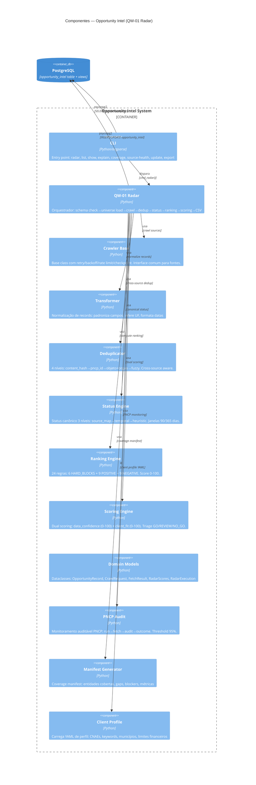
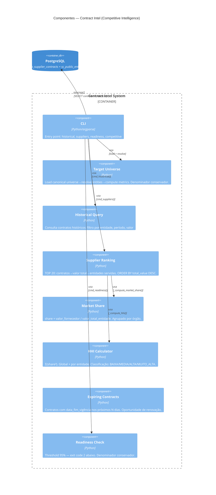
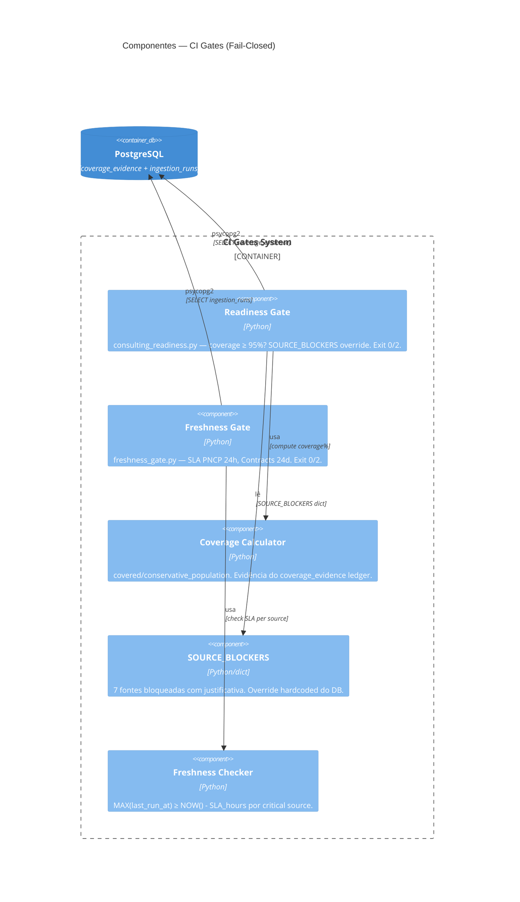
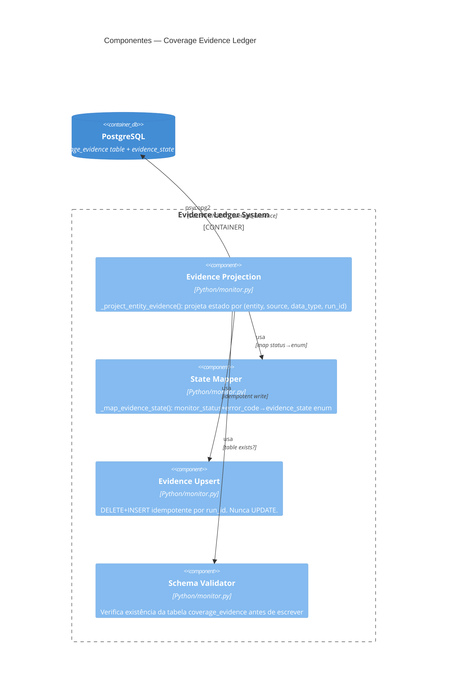

# C4 Componentes (Nível 3) — Extra Consultoria

> Gerado pelo Architect em 2026-07-13T17:30:00Z
> doc_level: completo
> Base: commit 249340d
> Delta: +Opportunity Intel components, +Contract Intel components, +Gates components

---

## Componentes do Opportunity Intel System

## Componentes do Contract Intel System

## Componentes dos CI Gates

## Componentes do Evidence Ledger

## Tabela de Componentes por Container

| Container | Componentes | Complexidade |
|-----------|-----------|-------------|
| Opportunity Intel | CLI, Radar, CrawlerBase, Transformer, Dedup(4 níveis), Status(3 níveis), Ranking(24 regras), Scoring(dual), Models, PncpAudit, Manifest, Profile | 🔴 VERY_HIGH |
| Contract Intel | CLI, TargetUniverse, Historical, SupplierRanking, MarketShare, HHI, Expiring, ReadinessCheck | 🟠 HIGH |
| CI Gates | ReadinessGate, FreshnessGate, CoverageCalc, BlockerRegistry, FreshnessCheck | 🟡 MEDIUM |
| Evidence Ledger | Projection, StateMapper, Upsert, SchemaCheck | 🟡 MEDIUM |
| Crawl System | Monitor, Orchestrator v2, 10 Crawlers, 4 Templates, Common, Checkpoint, Security, Enricher, Transformer | 🔴 VERY_HIGH |
| Intel Pipeline | 7 estágios, 5 quality gates, 12 algoritmos | 🟠 HIGH |
