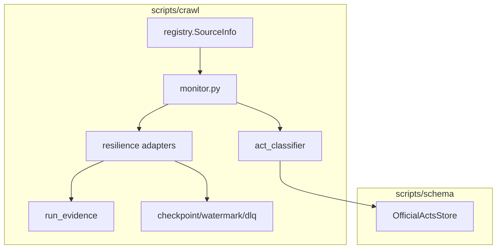
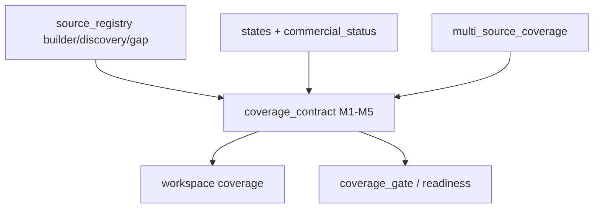
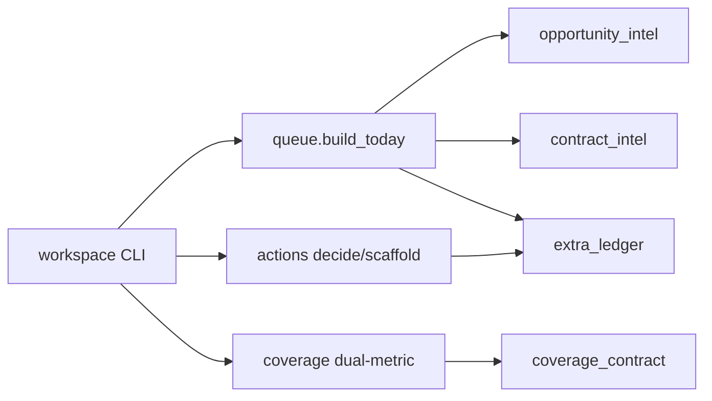
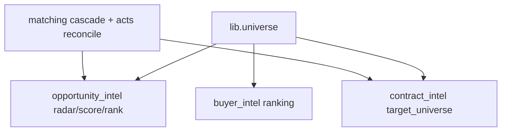

# C4 — Componentes (Nível 3)

> Architect 2026-07-17 🟢

## 1. Crawl Runtime

## 2. Coverage + ESR

## 3. Workspace Facade

## 4. Product intel

## Component inventory (alto nível)

| Container | Componentes |
|-----------|-------------|
| Crawl | registry, monitor, crawlers×11, resilience, act_classifier, provenance |
| Identity | universe, ESR, entity_matcher, official_acts_reconcile |
| Truth | coverage_contract, states, multi_source, commercial_status |
| Product | opportunity_intel, contract_intel, buyer_intel, workspace |
| Delivery | reports, intel_pipeline legado |
| Control | consulting_readiness, freshness_gate, coverage_gate, ci_gate, ops |
