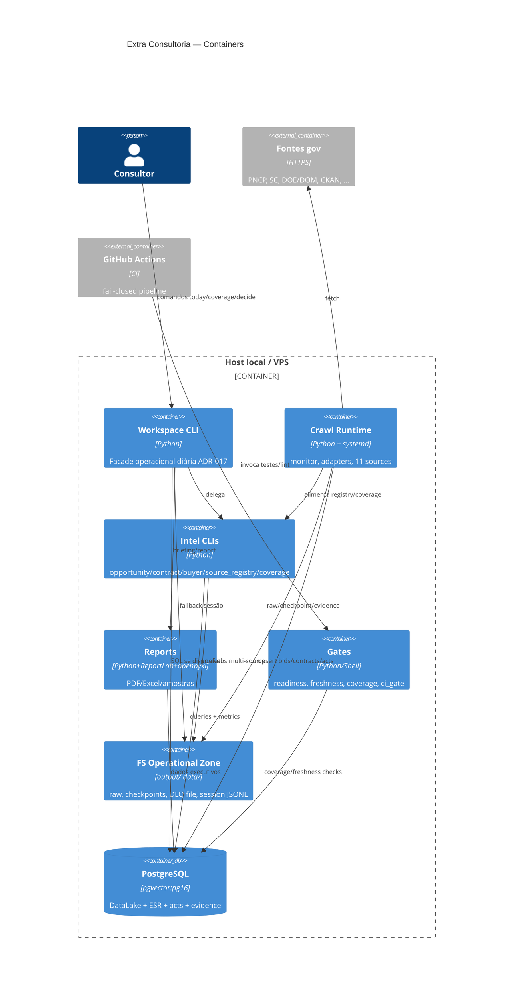

# C4 — Containers (Nível 2)

> Architect 2026-07-17 🟢

## Runtime notes
- **Pré-VPS:** filesystem é SoT de resilience; PG recebe projeções.  
- **Produção VPS:** systemd timers disparam crawl/report/health.  
