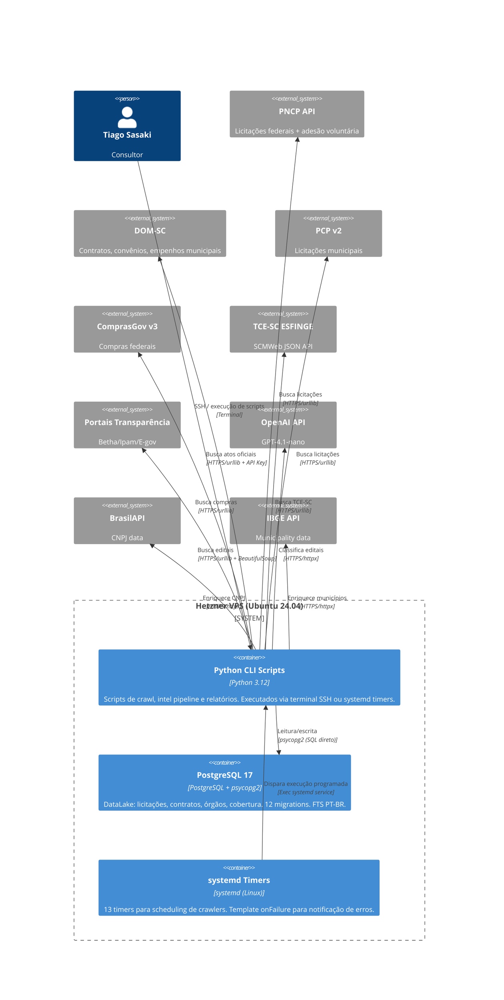

# C4 Containers (Nível 2) — Extra Consultoria

> Gerado pelo Architect em 2026-07-11T15:00:00Z
> 🟢 CONFIRMADO — baseado em `docs/architecture/architecture.md`, código, deploy/

---

## Containers

| Container | Tecnologia | Responsabilidade | Escala |
|-----------|-----------|------------------|--------|
| **Python CLI Scripts** | Python 3.12 | Crawlers, pipeline intel, relatórios, PDF/Excel | Single-process |
| **PostgreSQL 17** | PostgreSQL | DataLake: storage, FTS, RPCs, triggers | Single-instance (Hetzner VPS) |
| **systemd Timers** | systemd | Scheduling de 13 crawlers com staggered timers | 13 timers, 1 host |

## Comunicação

| De | Para | Protocolo | Síncrono? |
|----|------|-----------|-----------|
| CLI Scripts | PostgreSQL | psycopg2 (TCP :5432) | Sim |
| CLI Scripts | PNCP, DOM-SC, PCP, ComprasGov, TCE-SC, Transparência | HTTPS (urllib) | Sim |
| CLI Scripts | OpenAI, BrasilAPI, IBGE | HTTPS (httpx) | Sim/Async |
| systemd | CLI Scripts | Exec systemd service | Sim |
