# C4 Containers (Nível 2) — Extra Consultoria

> Gerado pelo Architect em 2026-07-11T22:00:00Z
> doc_level: completo

```mermaid
C4Container
    title Containers — Plataforma Extra Consultoria

    Person(consultor, "Consultor", "Tiago Sasaki")

    Container_Boundary(vps, "Hetzner CX22 — Ubuntu 24.04") {
        Container(monitor, "Monitor Multi-Source", "Python 3.12, urllib", "Orquestra 10 crawlers sync. Pipeline: crawl → transform → upsert → entity match → coverage")
        Container(orchestrator, "Orchestrator v2", "Python 3.12, psycopg2", "Refatoração do monitor com checkpoint TD-5.2. Delega matching para módulo externo")
        Container(crawlers, "Crawlers (10)", "Python 3.12, urllib+BeautifulSoup", "Um por fonte: PNCP, DOM-SC, DOE-SC, PCP, ComprasGov, TCE-SC, SC Compras, Contratos, Transparência (4 templates)")
        Container(intel, "Intel Pipeline", "Python 3.12, openai", "7 estágios: collect→enrich→validate→analyze(LLM)→extract→excel→pdf")
        Container(reports, "Reports Engine", "Python 3.12, reportlab+openpyxl", "Panorama, cobertura diário/semanal, proposta comercial, relatório B2G")
        Container(matching, "Entity Matcher", "Python 3.12, rapidfuzz", "Cascade 3 níveis: CNPJ → nome+município → fuzzy")
        Container(lib, "Shared Libraries", "Python 3.12", "Normalização, simulação lance, estimativa custos, victory profile, doc templates")
        Container(config, "Configuration", "YAML + Python", "Settings (env vars), 13 setores B2G, logging JSON, abbreviations")
        Container(systemd, "Systemd Scheduler", "systemd 20 timers", "Escalonamento de crawlers, reports, backup, health checks, métricas")

        ContainerDb(postgres, "PostgreSQL 18.4", "SQL + PL/pgSQL", "8 tabelas, 10 funções, 5 views. Dados: ~199K licitações, ~3.69M contratos")
        ContainerDb(storage, "Storage Box", "Hetzner SMB", "Backup pg_dump diário. Retenção 7+4")
    }

    System_Ext(pncp, "PNCP API", "Licitações/Contratos")
    System_Ext(apis_muni, "APIs Municipais/Estaduais", "DOM-SC, DOE-SC, PCP, TCE-SC, Portais")
    System_Ext(apis_fed, "APIs Federais", "ComprasGov, Portal Transparência, SICAF")
    System_Ext(openai, "OpenAI API", "GPT-4.1-nano")
    System_Ext(enrichment, "Enriquecimento", "BrasilAPI, IBGE, OSRM")

    Rel(consultor, monitor, "CLI", "python monitor.py --source --mode")
    Rel(consultor, orchestrator, "CLI", "python orchestrator.py")
    Rel(consultor, intel, "CLI", "python intel_pipeline.py --cnpj")
    Rel(consultor, reports, "CLI", "python panorama.py")

    Rel(monitor, crawlers, "importa módulo", "load_crawler(source)")
    Rel(orchestrator, crawlers, "importa módulo", "load_crawler(source)")
    Rel(monitor, postgres, "psycopg2", "upsert + match + coverage")
    Rel(orchestrator, matching, "importa", "match_entities_cascade()")
    Rel(orchestrator, postgres, "psycopg2", "upsert + checkpoint")
    Rel(matching, postgres, "psycopg2", "SELECT unmatched + UPDATE match")

    Rel(systemd, monitor, "timer", "schedule crawlers")
    Rel(systemd, reports, "timer", "schedule reports")
    Rel(systemd, intel, "timer", "schedule health/metrics")

    Rel(crawlers, pncp, "HTTPS/JSON", "GET licitações")
    Rel(crawlers, apis_muni, "HTTPS/JSON+HTML", "GET publicações")
    Rel(crawlers, apis_fed, "HTTPS/JSON+HTML", "GET licitações federais")

    Rel(intel, postgres, "psycopg2", "search_datalake RPC")
    Rel(intel, openai, "HTTPS/JSON", "GPT-4.1-nano + embeddings")
    Rel(intel, enrichment, "HTTPS/JSON", "CNPJ + IBGE + distâncias")
    Rel(reports, postgres, "psycopg2", "SELECT queries agregadas")

    Rel(postgres, storage, "pg_dump + rsync", "backup diário 06:00 UTC")

    Rel(lib, intel, "importado por", "bid_simulator, cost_estimator, victory_profile")
    Rel(lib, reports, "importado por", "name_normalizer")
    Rel(config, crawlers, "lido por", "settings + sectors YAML")
    Rel(config, intel, "lido por", "settings + sectors YAML")

    UpdateLayoutConfig($c4ShapeInRow="3", $c4BoundaryInRow="1")
```

## Containers

| Container | Tecnologia | Responsabilidade |
|-----------|-----------|-----------------|
| **Monitor Multi-Source** | Python 3.12, urllib | Orquestrador legado: pipeline crawl→transform→upsert→match→coverage para 8 fontes |
| **Orchestrator v2** | Python 3.12, psycopg2 | Refatoração SRP do monitor. Checkpoint TD-5.2. Delega matching para módulo externo |
| **Crawlers (10)** | Python 3.12, urllib+BeautifulSoup | Um por fonte. Interface comum: `crawl(mode)→list[dict]`, `transform(records)→list[dict]` |
| **Intel Pipeline** | Python 3.12, openai | 7 estágios: collect→enrich→validate→analyze(LLM)→extract docs→excel→pdf |
| **Reports Engine** | Python 3.12, reportlab+openpyxl | Panorama, cobertura diário/semanal, proposta comercial PDF, B2G report 6.4K LOC |
| **Entity Matcher** | Python 3.12, rapidfuzz | Cascade 3 níveis standalone. Índices in-memory. Batch transaction |
| **Shared Libraries** | Python 3.12 | 11 módulos: normalização, simulação, estimativa, victory profile, doc templates, etc. |
| **Configuration** | YAML + Python | Settings env vars, 13 setores B2G (8.8K LOC YAML), logging JSON, abbreviations |
| **Systemd Scheduler** | systemd (20 timers) | Crawlers diários a 3×/dia, reports diários/semanais, backup, health, métricas |
| **PostgreSQL 18.4** | SQL + PL/pgSQL | 8 tabelas, 10 funções, 5 views, ~3.9M registros |
| **Storage Box** | Hetzner SMB | Backup pg_dump diário, retenção 7+4 |
