# C4 Containers (Nível 2) — Extra Consultoria

> Gerado pelo Architect em 2026-07-13T17:30:00Z
> doc_level: completo
> Base: commit 249340d
> Delta: +4 containers (Opportunity Intel, Contract Intel, Readiness Gate, Freshness Gate)

```mermaid
C4Container
    title Containers — Plataforma Extra Consultoria

    Person(consultor, "Consultor", "Tiago Sasaki")

    Container_Boundary(vps, "Hetzner CX22 — Ubuntu 24.04") {
        Container(monitor, "Monitor Multi-Source", "Python 3.12, urllib", "Orquestra crawlers sync. Pipeline: crawl→transform→upsert→entity match→evidence projection")
        Container(crawlers, "Crawlers (10)", "Python 3.12, urllib+BeautifulSoup", "Um por fonte: PNCP, DOM-SC, DOE-SC, PCP, ComprasGov, TCE-SC, Contratos, Transparência (4 templates)")
        Container(opportunity, "Opportunity Intel", "Python 3.12, psycopg2", "QW-01 Radar: crawl→dedup→status canônico→ranking→scoring→CSV. CLI: list, show, explain, coverage")
        Container(contract_intel, "Contract Intel", "Python 3.12, psycopg2", "Target universe + consulta contratos históricos + supplier ranking + competitive intel (HHI, market share)")
        Container(intel, "Intel Pipeline", "Python 3.12, openai", "7 estágios: collect→enrich→validate→analyze(LLM)→extract docs→excel→pdf. Legado, em transição.")
        Container(reports, "Reports Engine", "Python 3.12, reportlab+openpyxl", "Panorama, cobertura semanal, proposta comercial, relatório B2G")
        Container(matching, "Entity Matcher", "Python 3.12, rapidfuzz", "Cascade 3 níveis: CNPJ8→nome+município→fuzzy. Standalone.")
        Container(readiness, "Readiness Gate", "Python 3.12, psycopg2", "CI gate: coverage ≥ 95%? Exit 0/2. SOURCE_BLOCKERS override. Fail-closed.")
        Container(freshness, "Freshness Gate", "Python 3.12, psycopg2", "CI gate: SLA PNCP 24h, Contracts 24d. Exit 0/2. Fail-closed.")
        Container(lib, "Shared Libraries", "Python 3.12", "Canonical universe, value semantics (5 estágios), geocode, name normalizer, victory profile, bid simulator")
        Container(config, "Configuration", "YAML + Python", "Settings (env vars), 13 setores B2G, client profiles, logging JSON")
        Container(systemd, "Systemd Scheduler", "systemd 20 timers", "Crawlers, reports, backup, health checks, QW-01 radar scheduled run")

        ContainerDb(postgres, "PostgreSQL 18.4", "SQL + PL/pgSQL", "10 tabelas, 12 funções, 6 views, evidence_state enum. Dados: ~199K licitações, ~3.69M contratos, coverage_evidence ledger")
        ContainerDb(storage, "Storage Box", "Hetzner SMB", "Backup pg_dump diário. Retenção 7+4")
    }

    System_Ext(pncp, "PNCP API v3", "Licitações/Contratos — ATIVA")
    System_Ext(apis_bloq, "APIs Bloqueadas", "DOM-SC, DOE-SC, PCP, TCE-SC, Transparência — SOURCE_BLOCKERS")
    System_Ext(openai, "OpenAI API", "GPT-4.1-nano")
    System_Ext(enrichment, "Enriquecimento", "BrasilAPI, IBGE, Portal Transparência")
    System_Ext(seed, "Planilha Seed", "Extra - alvos de licitação. R-0.xlsx")

    Rel(consultor, opportunity, "CLI", "python cli.py radar|list|show|explain")
    Rel(consultor, contract_intel, "CLI", "python cli.py historical|suppliers|readiness")
    Rel(consultor, monitor, "CLI", "python monitor.py --source --mode")
    Rel(consultor, intel, "CLI", "python intel_pipeline.py --cnpj")
    Rel(consultor, reports, "CLI", "python panorama.py")

    Rel(monitor, crawlers, "importa módulo", "load_crawler(source)")
    Rel(monitor, postgres, "psycopg2", "upsert + evidence projection")
    Rel(monitor, matching, "importa", "match_entities_cascade()")
    Rel(opportunity, postgres, "psycopg2", "INSERT/UPDATE opportunity_intel + scoring")
    Rel(opportunity, lib, "importa", "canonical universe + profile")
    Rel(contract_intel, postgres, "psycopg2", "SELECT contratos + competitive metrics")
    Rel(contract_intel, lib, "importa", "target universe + value semantics")

    Rel(readiness, postgres, "psycopg2", "SELECT coverage_evidence → manifest.json")
    Rel(readiness, lib, "importa", "canonical universe (denominador)")
    Rel(freshness, postgres, "psycopg2", "SELECT MAX(last_run_at) → gate.json")

    Rel(systemd, monitor, "timer", "schedule crawlers")
    Rel(systemd, opportunity, "timer", "QW-01 radar scheduled run")
    Rel(systemd, readiness, "timer", "readiness assessment")

    Rel(crawlers, pncp, "HTTPS/JSON", "GET licitações + contratos")
    Rel(crawlers, apis_bloq, "HTTPS/JSON+HTML", "BLOQUEADAS — SOURCE_BLOCKERS")

    Rel(intel, postgres, "psycopg2", "search_datalake RPC")
    Rel(intel, openai, "HTTPS/JSON", "GPT-4.1-nano + embeddings")
    Rel(intel, enrichment, "HTTPS/JSON", "CNPJ + IBGE + sanções")
    Rel(reports, postgres, "psycopg2", "SELECT queries agregadas")

    Rel(lib, opportunity, "importado por", "universe, geocode, profile")
    Rel(lib, contract_intel, "importado por", "universe, value_semantics")
    Rel(lib, intel, "importado por", "bid_simulator, cost_estimator, victory_profile")
    Rel(lib, reports, "importado por", "name_normalizer")
    Rel(config, crawlers, "lido por", "settings + sectors YAML")
    Rel(config, opportunity, "lido por", "client profiles YAML")

    Rel(postgres, storage, "pg_dump + rsync", "backup diário 06:00 UTC")

    UpdateLayoutConfig($c4ShapeInRow="3", $c4BoundaryInRow="1")
```

## Containers

| Container | Tecnologia | Responsabilidade |
|-----------|-----------|-----------------|
| **Monitor Multi-Source** | Python 3.12, urllib | Orquestrador legado: pipeline crawl→transform→upsert→match→evidence projection |
| **Crawlers (10)** | Python 3.12, urllib+BS4 | Um por fonte. Interface comum: `crawl()→list[dict]`, `transform()→list[dict]` |
| **Opportunity Intel** | Python 3.12, psycopg2 | **NOVO** — QW-01 Radar operacional. Crawl→dedup 4 níveis→status canônico→ranking 24 regras→scoring→CSV auditável |
| **Contract Intel** | Python 3.12, psycopg2 | **NOVO** — Target universe + contratos históricos + competitive intel (market share, HHI, supplier ranking) |
| **Intel Pipeline** | Python 3.12, openai | 7 estágios legado: collect→enrich→validate→analyze(LLM)→extract→excel→pdf |
| **Reports Engine** | Python 3.12, reportlab+openpyxl | Panorama, cobertura semanal, proposta comercial PDF, B2G report |
| **Entity Matcher** | Python 3.12, rapidfuzz | Cascade 3 níveis standalone. CNPJ8→nome+município→fuzzy |
| **Readiness Gate** | Python 3.12, psycopg2 | **NOVO** — CI gate fail-closed. Coverage ≥ 95%? Exit 0/2. SOURCE_BLOCKERS override |
| **Freshness Gate** | Python 3.12, psycopg2 | **NOVO** — CI gate fail-closed. SLA por fonte (PNCP 24h, Contracts 24d). Exit 0/2 |
| **Shared Libraries** | Python 3.12 | 12 módulos: universe, value_semantics, geocode, name_normalizer, victory_profile, bid_simulator, cost_estimator, entity_hierarchy, doc_templates |
| **Configuration** | YAML + Python | Settings env vars, 13 setores B2G (8.8K LOC YAML), client profiles, logging JSON |
| **Systemd Scheduler** | systemd (20 timers) | Crawlers diários, QW-01 radar, reports diários/semanais, backup, health, métricas |
| **PostgreSQL 18.4** | SQL + PL/pgSQL | 10 tabelas, 12 funções, 6 views, evidence_state enum, ~4M registros |
| **Storage Box** | Hetzner SMB | Backup pg_dump diário, retenção 7+4 |
