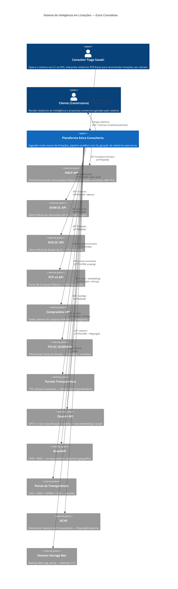

# C4 Contexto (Nível 1) — Extra Consultoria

> Gerado pelo Architect em 2026-07-11T22:00:00Z
> doc_level: completo

## Personas

| Persona | Descrição | Interação |
|---------|----------|-----------|
| **Consultor Tiago Sasaki** | Opera o sistema, interpreta resultados, recomenda licitações | CLI, SSH, systemd timers |
| **Cliente (Construtora)** | Recebe relatórios de inteligência e propostas comerciais | PDF, Excel (entrega manual) |

## Sistemas Externos

| Sistema | Tipo | Dados | Frequência |
|---------|------|-------|-----------|
| PNCP API | Fonte primária | Licitações, contratos, ARP, PCA | Full diário + inc 3×/dia |
| DOM-SC API | Fonte municipal | Publicações de 600+ órgãos | 3×/dia |
| DOE-SC API | Fonte estadual | Matérias do diário oficial | Diário |
| PCP v2 API | Fonte municipal | Processos de compra | 2×/dia |
| ComprasGov API | Fonte federal | Licitações federais (legado + Lei 14.133) | Diário |
| TCE-SC | Fonte fiscal | Licitações + contratos TCE | Diário |
| Portais Transparência | Fonte municipal | 170+ portais (4 templates) | Semanal |
| OpenAI | IA | GPT-4.1-nano + embeddings | On-demand (pipeline Intel) |
| BrasilAPI | Enriquecimento | CNPJ + IBGE | Batch diário |
| Portal Transparência | Compliance | CEIS, CNEP, CEPIM, CEAF | On-demand |
| SICAF | Cadastral | Verificação de fornecedor | On-demand (pipeline Intel) |
| Hetzner Storage Box | Backup | pg_dump diário | Diário 06:00 UTC |
