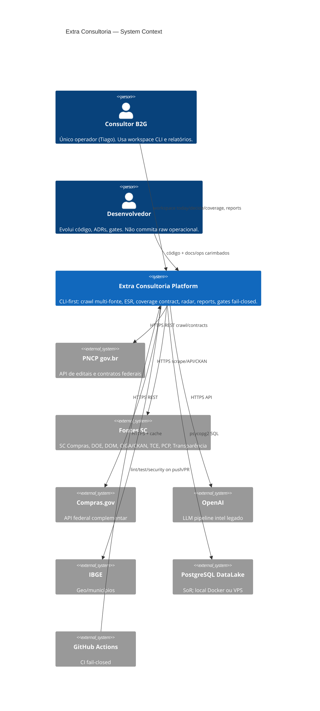

# C4 — Contexto (Nível 1)

> Architect 2026-07-17 🟢

```mermaid
C4Context
    title Extra Consultoria — System Context

    Person(consultor, "Consultor B2G", "Único operador (Tiago). Usa workspace CLI e relatórios.")
    Person(dev, "Desenvolvedor", "Evolui código, ADRs, gates. Não commita raw operacional.")

    System(extra, "Extra Consultoria Platform", "CLI-first: crawl multi-fonte, ESR, coverage contract, radar, reports, gates fail-closed.")

    System_Ext(pncp, "PNCP gov.br", "API de editais e contratos federais")
    System_Ext(sc, "Fontes SC", "SC Compras, DOE, DOM, CIGA/CKAN, TCE, PCP, Transparência")
    System_Ext(compras, "Compras.gov", "API federal complementar")
    System_Ext(openai, "OpenAI", "LLM pipeline intel legado")
    System_Ext(ibge, "IBGE", "Geo/municípios")
    System_Ext(pg, "PostgreSQL DataLake", "SoR; local Docker ou VPS")
    System_Ext(gh, "GitHub Actions", "CI fail-closed")

    Rel(consultor, extra, "workspace today/decide/coverage, reports")
    Rel(dev, extra, "código + docs/ops carimbados")
    Rel(extra, pncp, "HTTPS REST crawl/contracts")
    Rel(extra, sc, "HTTPS scrape/API/CKAN")
    Rel(extra, compras, "HTTPS REST")
    Rel(extra, openai, "HTTPS API")
    Rel(extra, ibge, "HTTPS + cache")
    Rel(extra, pg, "psycopg2 SQL")
    Rel(gh, extra, "lint/test/security on push/PR")
```

## Notas
- Single-tenant, sem portal multi-usuário.  
- Evidência carimbada em git (`docs/ops`); raw em `output/` (ADR-020).  
