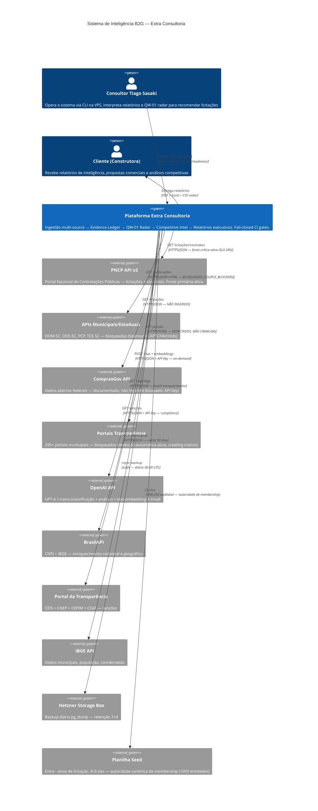

# C4 Contexto (Nível 1) — Extra Consultoria

> Gerado pelo Architect em 2026-07-13T17:30:00Z
> doc_level: completo
> Base: commit 249340d (QW-01 Radar + Competitive Intel + Readiness Gates)
> Delta: +2 verticais de produto (Opportunity Intel, Contract Intel), +3 gates de CI

## Personas

| Persona | Descrição | Interação |
|---------|----------|-----------|
| **Consultor Tiago Sasaki** | Opera o sistema, interpreta QW-01 radar, recomenda licitações | CLI, SSH, systemd timers, QW-01 CSV |
| **Cliente (Construtora)** | Recebe relatórios de inteligência, propostas e análises competitivas | PDF, Excel, CSV (entrega manual) |

## Sistemas Externos

| Sistema | Tipo | Dados | Status |
|---------|------|-------|--------|
| PNCP API v3 | Fonte primária ATIVA | Licitações + contratos (SLA 24h) | ✅ Critical source |
| DOM-SC API | Fonte municipal | Publicações de 600+ órgãos | 🔴 Bloqueada (Selenium) |
| DOE-SC API | Fonte estadual | Matérias do diário oficial | 🔴 Bloqueada (cert. digital) |
| PCP v2 API | Fonte municipal | Processos de compra | 🔴 Bloqueada (Selenium+CAPTCHA) |
| ComprasGov API | Fonte federal | Licitações federais | 🟡 Não ingerido (API key) |
| TCE-SC (SCMWeb) | Fonte fiscal | Licitações + contratos | 🔴 Bloqueada (acesso instável) |
| Portais Transparência | Fonte municipal | 295+ portais (detectados) | 🔴 Bloqueados (Selenium) |
| OpenAI | IA | GPT-4.1-nano + embeddings | ✅ On-demand |
| BrasilAPI | Enriquecimento | CNPJ + IBGE | ✅ Batch diário |
| IBGE API | Enriquecimento | Dados municipais | ✅ Cache 90 dias |
| Portal Transparência | Compliance | CEIS, CNEP, CEPIM, CEAF | ✅ On-demand |
| Planilha Seed | Membership | Universo canônico (1093 entidades) | ✅ SHA-256 auditável |
| Hetzner Storage Box | Backup | pg_dump diário | ✅ Diário 06:00 UTC |
