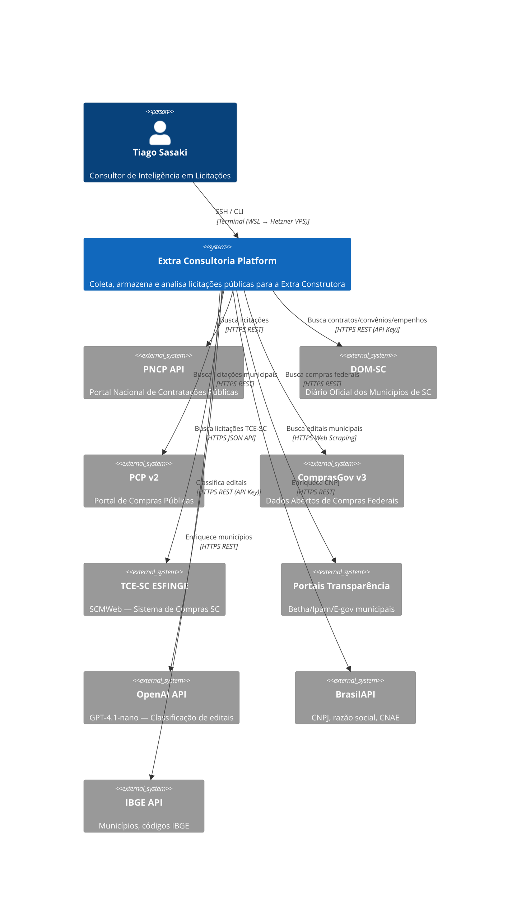

# C4 Contexto (Nível 1) — Extra Consultoria

> Gerado pelo Architect em 2026-07-11T15:00:00Z
> 🟢 CONFIRMADO — baseado em `docs/architecture/architecture.md`, PRD, `config/settings.py`

---

## Personas

| Persona | Papel | Acesso |
|---------|-------|--------|
| **Tiago Sasaki** | Consultor de Inteligência — único usuário | SSH no Hetzner VPS, acesso total ao PostgreSQL |

## Sistemas Externos

| Sistema | Tipo | Protocolo | Autenticação | Cobertura |
|---------|------|-----------|--------------|-----------|
| **PNCP API** | Fonte primária de licitações | HTTPS REST | Pública | Nacional |
| **DOM-SC** | Diário Oficial Municipal SC | HTTPS REST | API Key | ~280 municípios SC |
| **PCP v2** | Portal de Compras Públicas | HTTPS REST | Pública | 100+ municípios SC |
| **ComprasGov v3** | Compras federais | HTTPS REST | Pública | Órgãos federais SC |
| **TCE-SC ESFINGE** | Sistema de Compras SC (SCMWeb) | HTTPS JSON API | Pública | TCE-SC e entes estaduais |
| **Portais Transparência** | Betha/Ipam/E-gov | HTTPS Web Scraping | Pública | Gap-fill municipal |
| **OpenAI API** | Classificação LLM | HTTPS REST | API Key | — |
| **BrasilAPI** | Enriquecimento CNPJ | HTTPS REST | Pública | Nacional |
| **IBGE API** | Enriquecimento municípios | HTTPS REST | Pública | Nacional |

## Fluxos de Dados

| Fluxo | Direção | Frequência | Volume |
|-------|---------|------------|--------|
| Crawl → DataLake | Inbound | Diário (8 fontes) | ~500-2000 bids/dia |
| Enriquecimento → DataLake | Inbound | Diário | ~50-500 CNPJs/dia |
| Pipeline Intel → PDF/Excel | Outbound | On-demand | 1 relatório por CNPJ |
| Panorama → Terminal/PDF/Excel | Outbound | On-demand / Semanal | 1 relatório |
| Coverage Report → Terminal | Outbound | Diário | 1 relatório |
