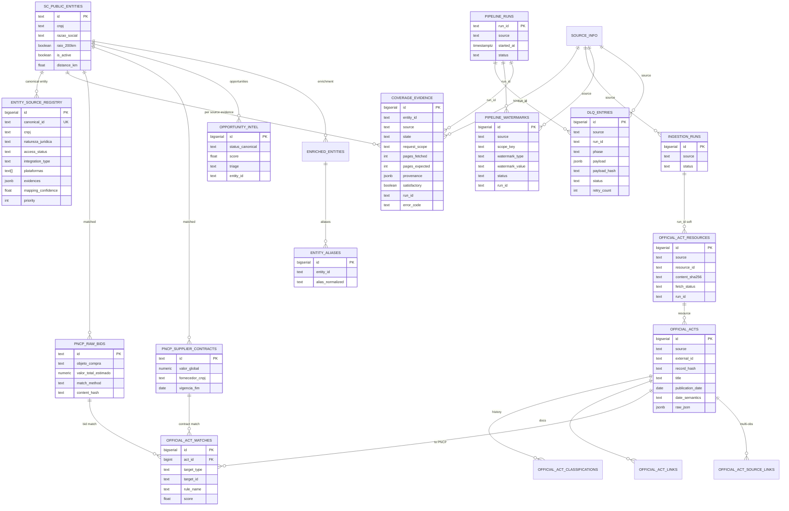

# ERD Completo — Extra Consultoria

> Architect 2026-07-17 🟢 (migrations 001–054 + models código)

## Notas de cardinalidade e integridade

| Tema | Detalhe |
|------|---------|
| Universo | 1093 ativos `raio_200km` — denominador M1/M2 |
| ESR | UNIQUE `canonical_id`; UNIQUE (cnpj, natureza, razao_social) |
| Official acts | UNIQUE parcial (source, resource_id) / (source, content_sha256) |
| Evidence satisfactory | CHECK composto mig 054 |
| DLQ pending | UNIQUE parcial (source, payload_hash, error_code) |
| Watermarks | UNIQUE (source, scope_key, type, value) |
| Soft FKs | `run_id` frequentemente TEXT soft-ref (não FK rígida) |

## Tabelas legadas adicionais (não expandido no diagrama)

`capability_coverage`, `target_universe_snapshot`, `value_observations`, `supplier_identity`, reporting views 036, schema contract views 030 — ver migrations 030–040.
