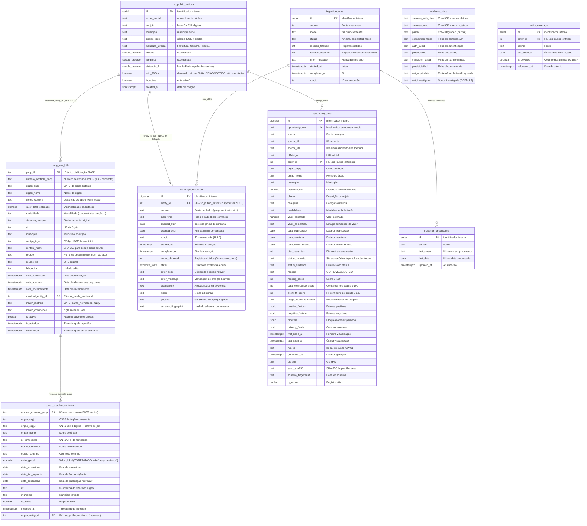

# ERD Completo — Extra Consultoria DataLake

> Gerado pelo Architect em 2026-07-13T17:30:00Z
> doc_level: completo
> Base: commit 249340d, PostgreSQL 18.4 + PostGIS
> Delta: +2 tabelas (coverage_evidence, opportunity_intel), +1 enum (evidence_state)

## Relacionamentos

| Origem | Destino | Cardinalidade | FK | Notas |
|--------|---------|:---:|-----|-------|
| sc_public_entities | pncp_raw_bids | 1:N | matched_entity_id | SET NULL on entity delete |
| sc_public_entities | coverage_evidence | 1:N | entity_id | Pode ser NULL (run sem entity match) |
| sc_public_entities | opportunity_intel | 1:N | entity_id | Pode ser NULL |
| pncp_raw_bids | pncp_supplier_contracts | 1:N | numero_controle_pncp | Nem todo bid tem contrato |
| ingestion_runs | coverage_evidence | 1:N | run_id | Uma run gera N evidências |
| ingestion_runs | ingestion_checkpoints | 1:N | source | Checkpoint por fonte |

## Views Analíticas

| View | Base | Propósito |
|------|------|-----------|
| `entity_coverage` | sc_public_entities + pncp_raw_bids | Trigger-maintained: entidade coberta se teve licitação em 90 dias |
| `coverage_summary` | coverage_evidence | Agregação: cobertura por source, data_type, state |
| `latest_evidence` | coverage_evidence | DISTINCT ON (entity_id, source, data_type): último estado por entidade |
| `vw_opportunity_ranking` | opportunity_intel | Ranking materializado: GO/REVIEW/NO_GO com scores |
| `vw_competitive_intel` | pncp_supplier_contracts + sc_public_entities | Fornecedores agregados por entidade |
| `readiness_dashboard` | coverage_evidence + sc_public_entities | Métricas de readiness: cobertura%, gaps, blockers |

## Índices Críticos

| Tabela | Índice | Tipo | Propósito |
|--------|--------|------|-----------|
| coverage_evidence | `idx_evidence_entity_source` | B-tree (entity_id, source, data_type) | Latest evidence query |
| coverage_evidence | `idx_evidence_run` | B-tree (run_id) | Run-level aggregation |
| coverage_evidence | `idx_evidence_state` | Partial (state = 'success_with_data') | Readiness metrics |
| opportunity_intel | `idx_oi_status_ranking` | B-tree (status_canonico, ranking) | List/filter queries |
| opportunity_intel | `idx_oi_entity` | B-tree (entity_id) | Entity-level queries |
| opportunity_intel | `idx_oi_opportunity_key` | UNIQUE (opportunity_key) | Dedup UPSERT |
| opportunity_intel | `idx_oi_numero_controle` | B-tree (numero_controle_pncp) | PNCP cross-reference |
| pncp_raw_bids | `idx_bids_objeto_gin` | GIN (objeto_compra) | Full-text search |
| pncp_raw_bids | `idx_bids_content_hash` | B-tree (content_hash) | Dedup lookup |
