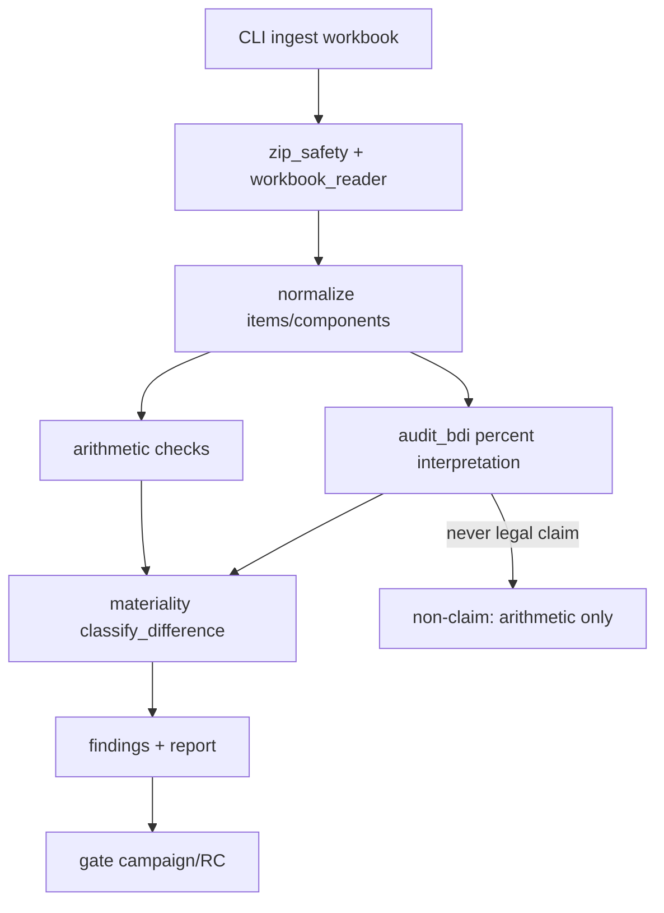

# Flowcharts — `budget_audit`

> 🟢 2026-07-28 | HEAD `ffbb9608`

```mermaid
flowchart TD
  A[CLI ingest workbook] --> B[zip_safety + workbook_reader]
  B --> C[normalize items/components]
  C --> D[arithmetic checks]
  C --> E[audit_bdi percent interpretation]
  D --> F[materiality classify_difference]
  E --> F
  F --> G[findings + report]
  G --> H[gate campaign/RC]
  E -->|never legal claim| N[non-claim: arithmetic only]
```
