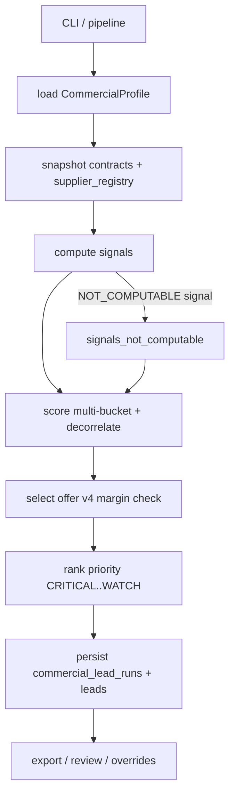
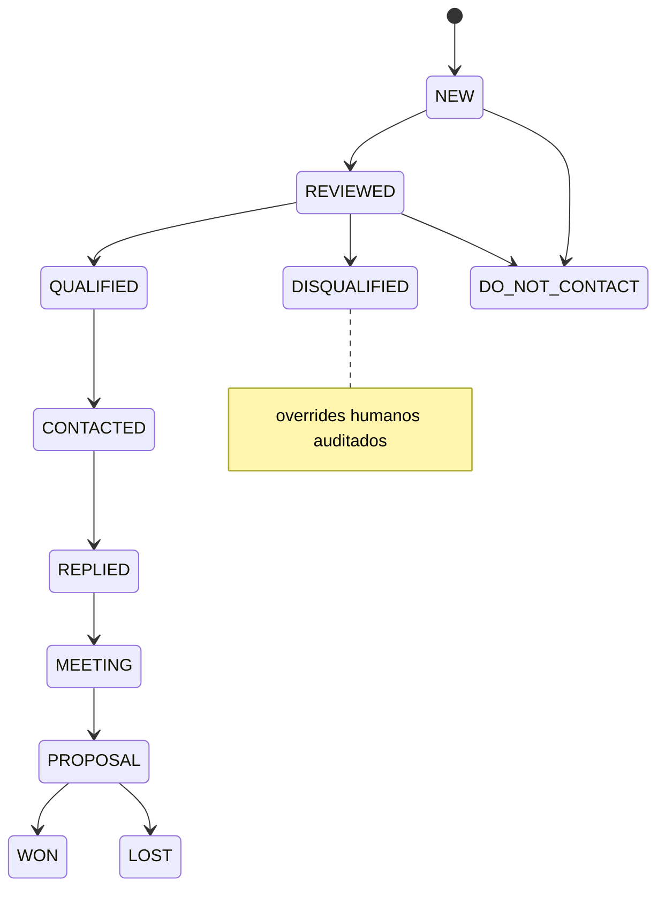

# Flowcharts — `commercial_leads`

> 🟢 2026-07-28 | HEAD `ffbb9608`

## Pipeline principal

```mermaid
flowchart TD
  A[CLI / pipeline] --> B[load CommercialProfile]
  B --> C[snapshot contracts + supplier_registry]
  C --> D[compute signals]
  D --> E[score multi-bucket + decorrelate]
  E --> F[select offer v4 margin check]
  F --> G[rank priority CRITICAL..WATCH]
  G --> H[persist commercial_lead_runs + leads]
  H --> I[export / review / overrides]
  D -->|NOT_COMPUTABLE signal| J[signals_not_computable]
  J --> E
```

## Estados comerciais

```mermaid
stateDiagram-v2
  [*] --> NEW
  NEW --> REVIEWED
  REVIEWED --> QUALIFIED
  REVIEWED --> DISQUALIFIED
  QUALIFIED --> CONTACTED
  CONTACTED --> REPLIED
  REPLIED --> MEETING
  MEETING --> PROPOSAL
  PROPOSAL --> WON
  PROPOSAL --> LOST
  NEW --> DO_NOT_CONTACT
  REVIEWED --> DO_NOT_CONTACT
  note right of DISQUALIFIED: overrides humanos auditados
```
