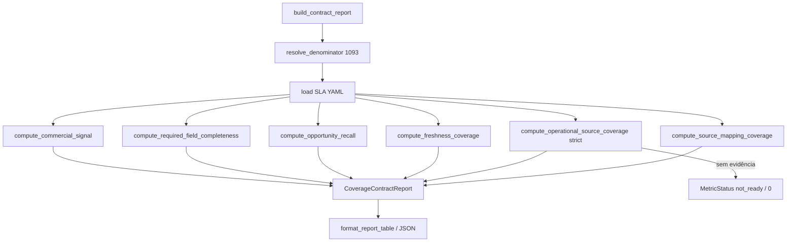
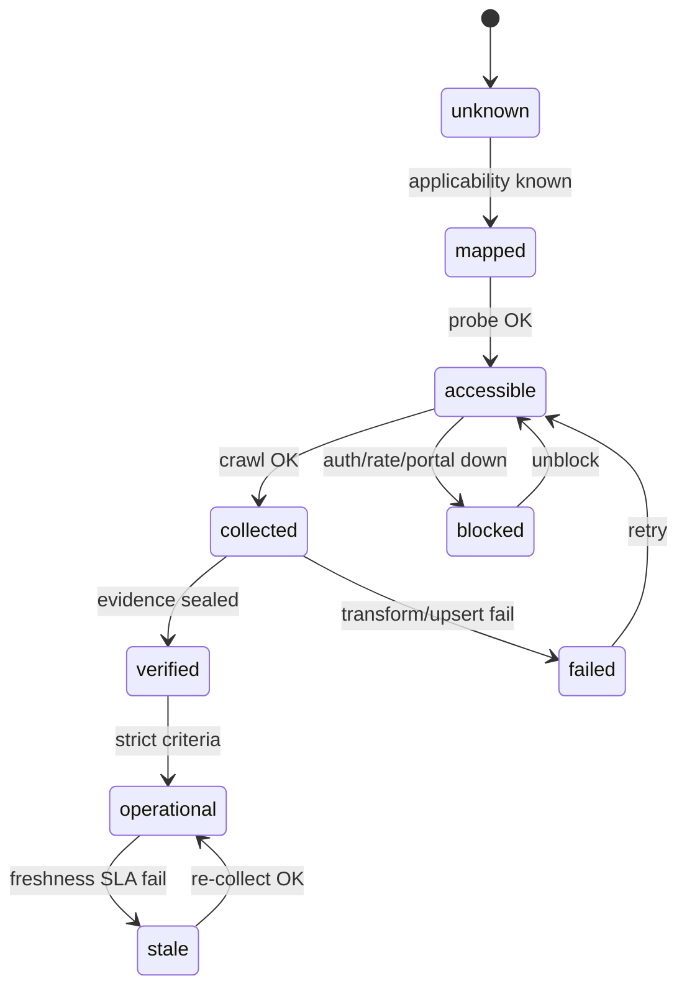
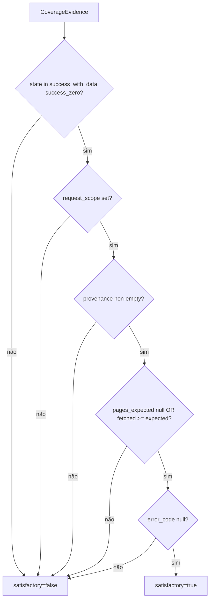

# Flowcharts — módulo `coverage`

> 🟢 CONFIRMADO — 2026-07-17

## 1. Coverage contract report

```mermaid
flowchart TD
    A[build_contract_report] --> B[resolve_denominator 1093]
    B --> C[load SLA YAML]
    C --> D[compute_source_mapping_coverage]
    C --> E[compute_operational_source_coverage strict]
    C --> F[compute_freshness_coverage]
    C --> G[compute_opportunity_recall]
    C --> H[compute_required_field_completeness]
    C --> I[compute_commercial_signal]
    D --> J[CoverageContractReport]
    E --> J
    F --> J
    G --> J
    H --> J
    I --> J
    J --> K[format_report_table / JSON]
    E -->|sem evidência| L[MetricStatus not_ready / 0]
```

## 2. Coverage state machine

```mermaid
stateDiagram-v2
    [*] --> unknown
    unknown --> mapped: applicability known
    mapped --> accessible: probe OK
    accessible --> collected: crawl OK
    collected --> verified: evidence sealed
    verified --> operational: strict criteria
    operational --> stale: freshness SLA fail
    stale --> operational: re-collect OK
    accessible --> blocked: auth/rate/portal down
    blocked --> accessible: unblock
    collected --> failed: transform/upsert fail
    failed --> accessible: retry
```

## 3. Evidence satisfactory (mig 054)

```mermaid
flowchart TD
    A[CoverageEvidence] --> B{state in success_with_data success_zero?}
    B -->|não| C[satisfactory=false]
    B -->|sim| D{request_scope set?}
    D -->|não| C
    D -->|sim| E{provenance non-empty?}
    E -->|não| C
    E -->|sim| F{pages_expected null OR fetched >= expected?}
    F -->|não| C
    F -->|sim| G{error_code null?}
    G -->|não| C
    G -->|sim| H[satisfactory=true]
```
