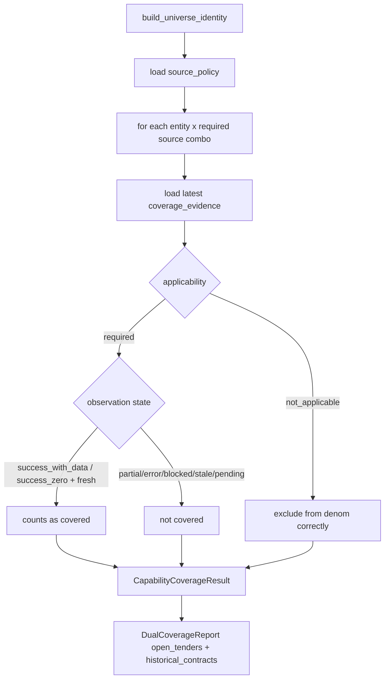
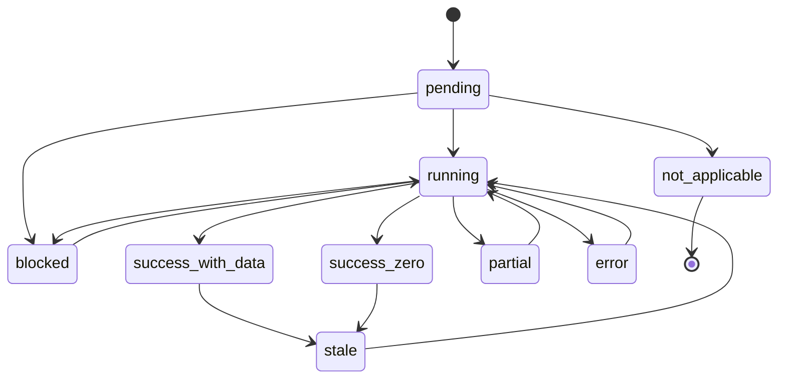
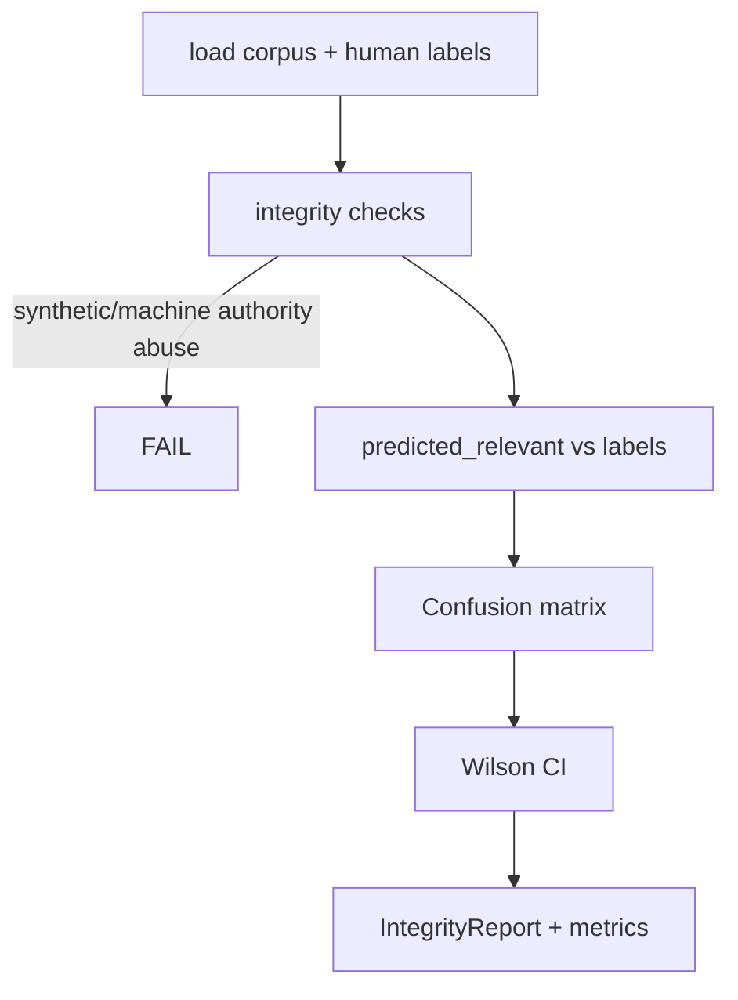

# Flowcharts — `coverage`

> 🟢 2026-07-28 | HEAD `ffbb9608`

## 1. Dual capability coverage

```mermaid
flowchart TD
  A[build_universe_identity] --> B[load source_policy]
  B --> C[for each entity x required source combo]
  C --> D[load latest coverage_evidence]
  D --> E{applicability}
  E -->|not_applicable| N[exclude from denom correctly]
  E -->|required| F{observation state}
  F -->|success_with_data / success_zero + fresh| G[counts as covered]
  F -->|partial/error/blocked/stale/pending| H[not covered]
  G --> I[CapabilityCoverageResult]
  H --> I
  N --> I
  I --> J[DualCoverageReport open_tenders + historical_contracts]
```

## 2. Coverage state machine (9 estados)

```mermaid
stateDiagram-v2
  [*] --> pending
  pending --> running
  pending --> blocked
  pending --> not_applicable
  running --> success_with_data
  running --> success_zero
  running --> partial
  running --> error
  running --> blocked
  success_with_data --> stale
  success_zero --> stale
  stale --> running
  partial --> running
  error --> running
  blocked --> running
  not_applicable --> [*]
```

## 3. Edital relevance recall

```mermaid
flowchart TD
  A[load corpus + human labels] --> B[integrity checks]
  B -->|synthetic/machine authority abuse| X[FAIL]
  B --> C[predicted_relevant vs labels]
  C --> D[Confusion matrix]
  D --> E[Wilson CI]
  E --> F[IntegrityReport + metrics]
```
