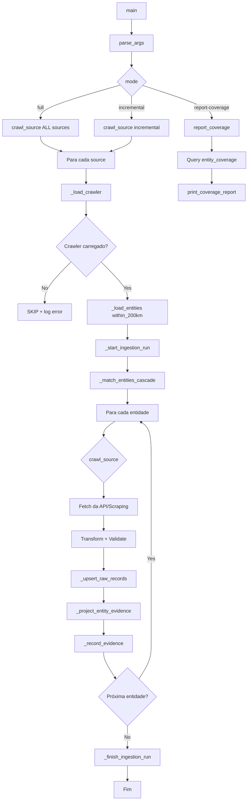
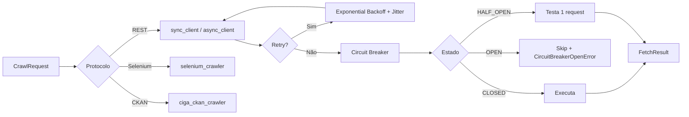
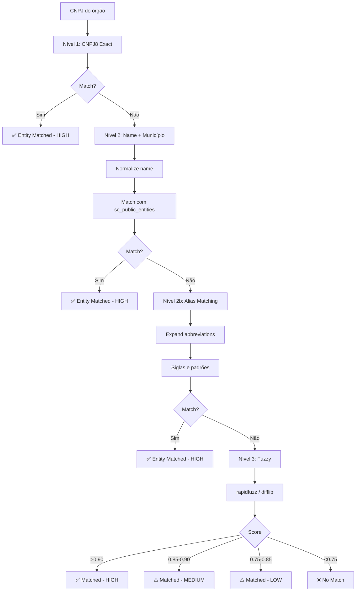
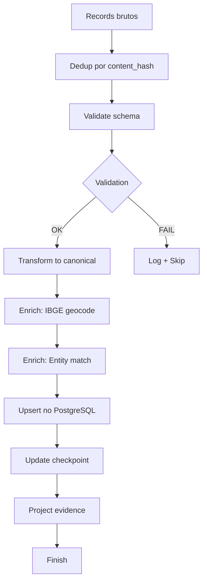
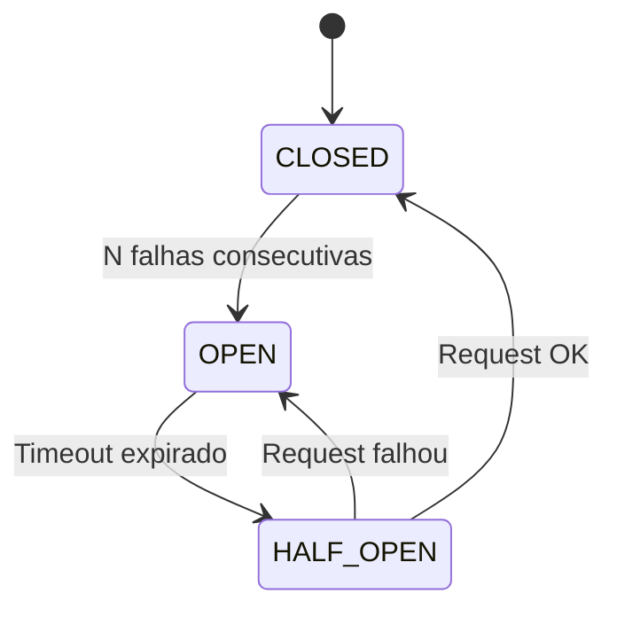

# Fluxograma — Módulo Crawl

> Gerado pelo Archaeologist em 2026-07-13

## Orquestrador Central (`monitor.py`)

## Pipeline de Crawl por Fonte

## Entity Matching Cascade

## Ingestion Pipeline

## Circuit Breaker

