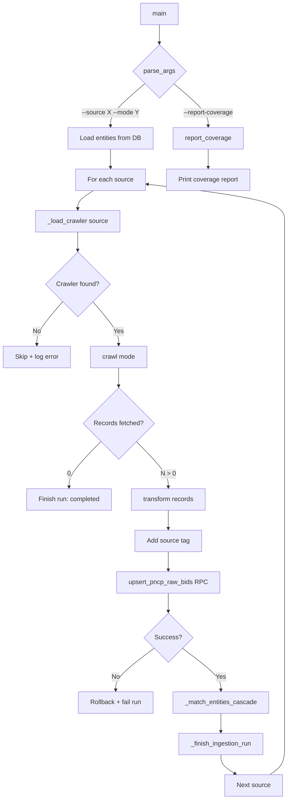
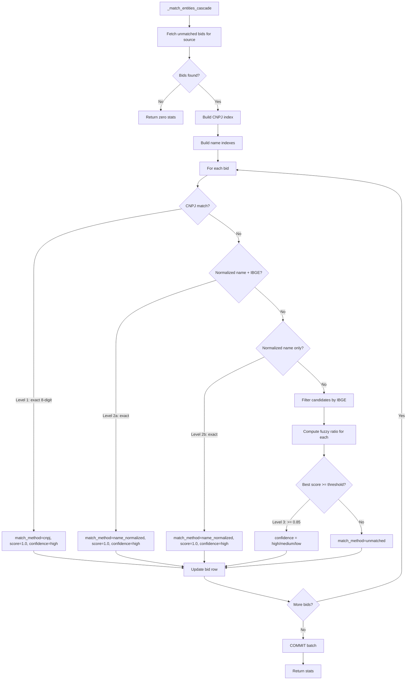

# Fluxograma — Módulo `crawl`

> Gerado pelo Archaeologist em 2026-07-11T13:00:00Z

---

## Pipeline Multi-Source (monitor.py)

## Entity Matching Cascade

## Ciclo de Ingestion (systemd → monitor.py)

```mermaid
flowchart LR
    A[systemd timer] --> B[monitor.py]
    B --> C[_load_entities]
    C --> D[crawl_source]
    D --> E[crawl API]
    E --> F[transform]
    F --> G[upsert RPC]
    G --> H[match entities]
    H --> I[update coverage]
    I --> J[ingestion_runs log]
    J --> K[report_coverage]
    K --> L[print summary]
```

