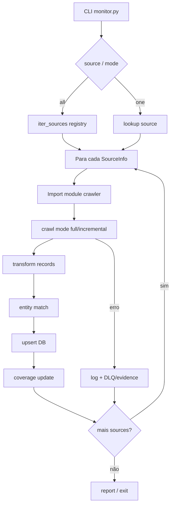
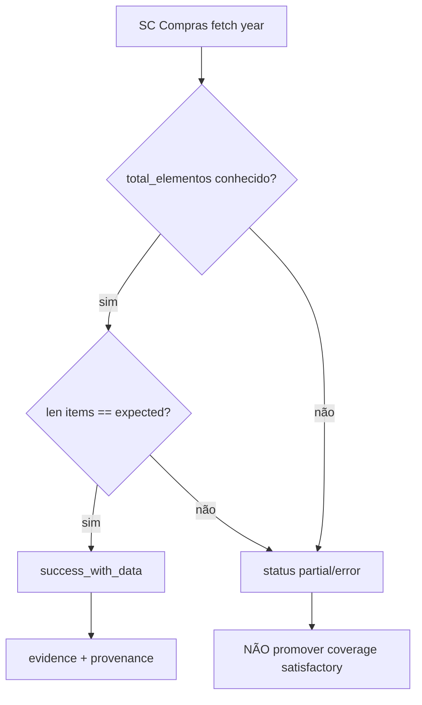

# Flowcharts — módulo `crawl`

> 🟢 CONFIRMADO — 2026-07-17

## 1. Monitor multi-source



## 2. Registry resolve


## 3. Resilience adapter cycle (pré-VPS)

```mermaid
flowchart TD
    A[run_cycle live|fixture] --> B[ResilienceConfig.from_env]
    B --> C[mkdir checkpoint raw dlq evidence]
    C --> D[Adapters PNCP CIGA SC]
    D --> E{budget OK?}
    E -->|não| F[stop partial]
    E -->|sim| G[load checkpoint]
    G --> H[fetch page/scope]
    H --> I[persist RawStore]
    I --> J[save CanonicalCheckpoint]
    J --> K{status}
    K -->|success_with_data / success_zero| L[EvidenceLedger write]
    K -->|partial / error / rate_limited| M[FileDLQ push]
    L --> N{more pages?}
    M --> N
    N -->|sim| E
    N -->|não| O[aggregate report]
```

## 4. Fail-closed SC bulk


