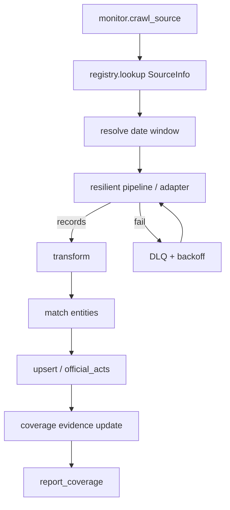

# Flowcharts — `crawl`

> 🟢 2026-07-28 | HEAD `ffbb9608`

```mermaid
flowchart TD
  A[monitor.crawl_source] --> B[registry.lookup SourceInfo]
  B --> C[resolve date window]
  C --> D[resilient pipeline / adapter]
  D -->|records| E[transform]
  E --> F[match entities]
  F --> G[upsert / official_acts]
  G --> H[coverage evidence update]
  D -->|fail| I[DLQ + backoff]
  I --> D
  H --> J[report_coverage]
```
