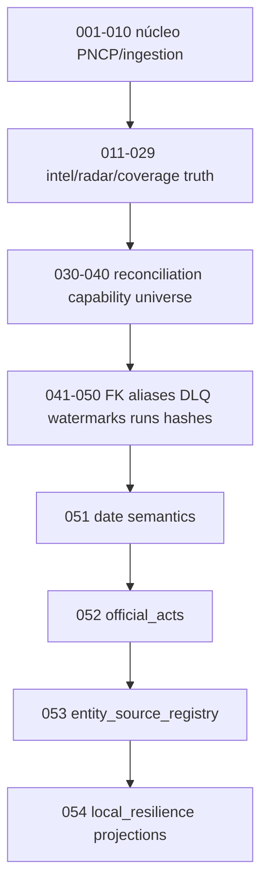
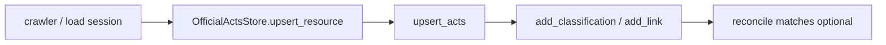

# Flowcharts — módulo `db` (schema evolution)

> 🟢 CONFIRMADO — 2026-07-17

## 1. Camadas de migrations

```mermaid
flowchart TD
    A[001-010 núcleo PNCP/ingestion] --> B[011-029 intel/radar/coverage truth]
    B --> C[030-040 reconciliation capability universe]
    C --> D[041-050 FK aliases DLQ watermarks runs hashes]
    D --> E[051 date semantics]
    E --> F[052 official_acts]
    F --> G[053 entity_source_registry]
    G --> H[054 local_resilience projections]
```

## 2. Official acts write path

```mermaid
flowchart LR
    A[crawler / load session] --> B[OfficialActsStore.upsert_resource]
    B --> C[upsert_acts]
    C --> D[add_classification / add_link]
    D --> E[reconcile matches optional]
```
