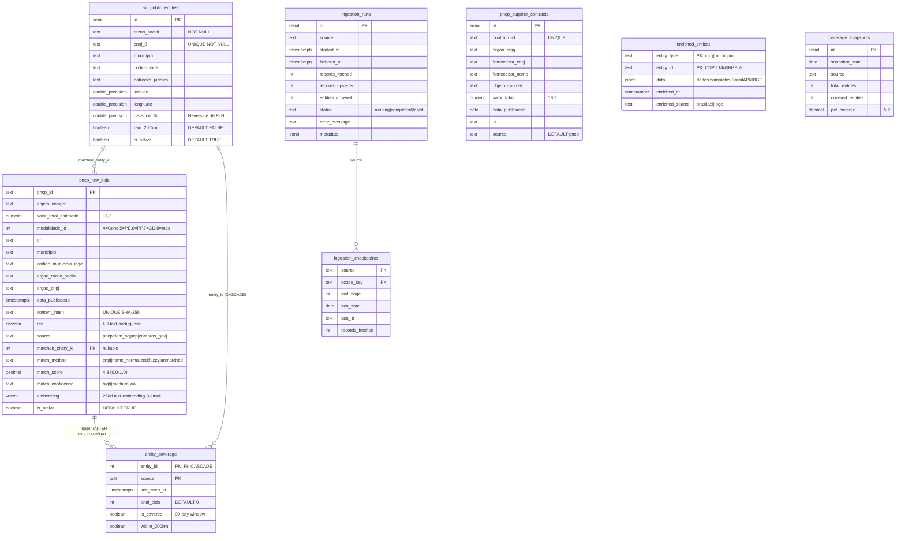

# Fluxograma — Módulo Database

> Gerado pelo Archaeologist em 2026-07-11T21:00:00Z
> doc_level: completo
> Base: commit e9729e1

## Schema Completo (ER Simplificado)



## Fluxo de Ingestão → Coverage (Triggers)

```mermaid
flowchart TD
    INSERT[INSERT pncp_raw_bids] --> TRG1{trigger: trg_bids_coverage<br/>AFTER INSERT}
    TRG1 --> FN1[update_entity_coverage()]
    FN1 --> CHECK_ENT{matched_entity_id<br/>IS NOT NULL?}
    CHECK_ENT -->|não| SKIP[Skip: sem entidade associada]
    CHECK_ENT -->|sim| UPSERT_COV[UPSERT entity_coverage<br/>ON CONFLICT entity_id, source<br/>DO UPDATE]
    UPSERT_COV --> SET_COV["SET<br/>last_seen_at = NOW()<br/>total_bids = total_bids + 1<br/>is_covered = TRUE<br/>within_200km = entity.raio_200km"]
    SET_COV --> END1([Fim])

    UPDATE[UPDATE pncp_raw_bids<br/>matched_entity_id muda] --> TRG2{trigger: trg_bids_coverage_update<br/>AFTER UPDATE}
    TRG2 --> FN2[update_entity_coverage_on_update()]
    FN2 --> OLD_CHECK{OLD.matched_entity_id<br/>≠ NEW.matched_entity_id?}
    OLD_CHECK -->|sim| DECR[Decrementa total_bids<br/>da entidade antiga]
    DECR --> INCR[Incrementa total_bids<br/>da nova entidade]
    INCR --> END2([Fim])
```

## Purge Flow (Soft + Hard Delete)

```mermaid
flowchart TD
    TIMER(["systemd timer: pncp-purge<br/>Diário 07:00 UTC"]) --> SOFT[purge_old_bids(400)]
    SOFT --> SCAN_SOFT["UPDATE pncp_raw_bids<br/>SET is_active = FALSE<br/>WHERE data_publicacao < NOW() - 400d<br/>AND is_active = TRUE"]
    SCAN_SOFT --> LOG1["Log: {purged_count} soft-deleted"]

    TIMER_HARD(["systemd timer: opcional"]) --> HARD[purge_old_bids_hard(90)]
    HARD --> SCAN_HARD["DELETE FROM pncp_raw_bids<br/>WHERE is_active = FALSE<br/>AND updated_at < NOW() - 90d"]
    SCAN_HARD --> LOG2["Log: {deleted_count} hard-deleted"]

    TTL(["systemd timer: pncp-enrich<br/>Diário 08:00 UTC"]) --> TTL_CLEAN[ttl_cleanup_enriched_entities(90)]
    TTL_CLEAN --> SCAN_TTL["DELETE FROM enriched_entities<br/>WHERE enriched_at < NOW() - 90d"]
    SCAN_TTL --> LOG3["Log: {deleted_count} expired cache"]
```

## Seed: IBGE Code Resolution

```mermaid
flowchart TD
    START(["resolve_ibge_code(municipio_nome, uf='SC')"]) --> TRY1{"Match exato na<br/>cache IBGE?"}
    TRY1 -->|sim| RETURN1["Retorna código IBGE"]
    TRY1 -->|não| TRY2{"Match sem conectivos?<br/>(remove de/da/do/das/dos)"}
    TRY2 -->|sim| RETURN2["Retorna código IBGE"]
    TRY2 -->|não| TRY3{"Match sem espaços?"}
    TRY3 -->|sim| RETURN3["Retorna código IBGE"]
    TRY3 -->|não| TRY4{"Prefix match<br/>3+ caracteres?"}
    TRY4 -->|sim| RETURN4["Retorna código IBGE"]
    TRY4 -->|não| API_CALL[Chama BrasilAPI<br/>/api/ibge/municipios/v1/{uf}]
    API_CALL --> API_MATCH{Match na API?}
    API_MATCH -->|sim| CACHE[Salva no cache JSON<br/>ibge_cache.json]
    CACHE --> RETURN5["Retorna código IBGE"]
    API_MATCH -->|não| NULL_RET["Retorna None<br/>município não resolvido"]
```
