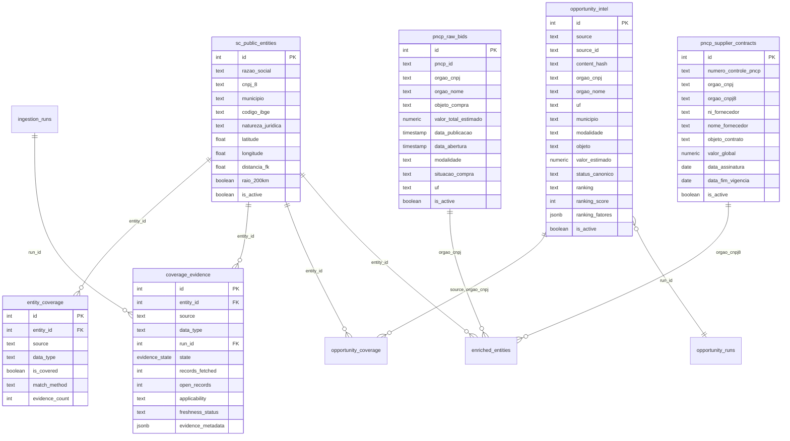
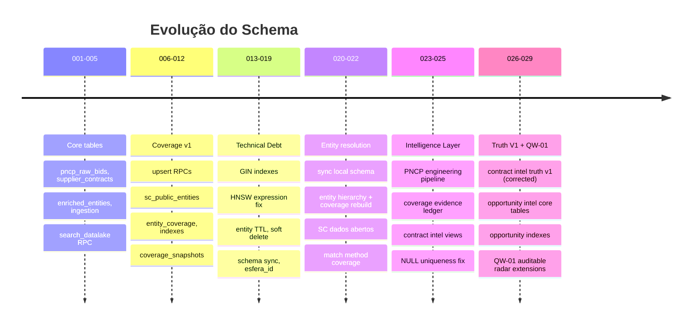
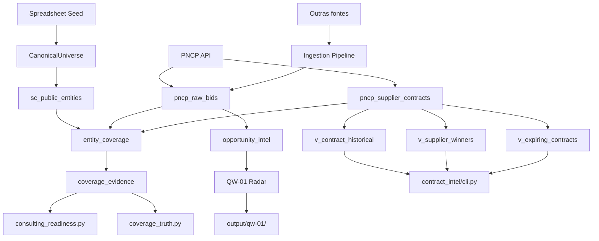

# Fluxograma — Módulo Database

> Gerado pelo Archaeologist em 2026-07-13

## ERD Simplificado

```mermaid
erDiagram
    sc_public_entities ||--o{ entity_coverage : "entity_id"
    sc_public_entities ||--o{ coverage_evidence : "entity_id"
    sc_public_entities ||--o{ opportunity_coverage : "entity_id"
    sc_public_entities ||--o{ enriched_entities : "entity_id"

    pncp_raw_bids ||--o{ enriched_entities : "orgao_cnpj"
    pncp_supplier_contracts ||--o{ enriched_entities : "orgao_cnpj8"

    opportunity_intel ||--o{ opportunity_coverage : "source, orgao_cnpj"
    opportunity_intel }o--|| opportunity_runs : "run_id"

    ingestion_runs ||--o{ coverage_evidence : "run_id"

    sc_public_entities {
        int id PK
        text razao_social
        text cnpj_8
        text municipio
        text codigo_ibge
        text natureza_juridica
        float latitude
        float longitude
        float distancia_fk
        boolean raio_200km
        boolean is_active
    }

    pncp_raw_bids {
        int id PK
        text pncp_id
        text orgao_cnpj
        text orgao_nome
        text objeto_compra
        numeric valor_total_estimado
        timestamp data_publicacao
        timestamp data_abertura
        text modalidade
        text situacao_compra
        text uf
        boolean is_active
    }

    pncp_supplier_contracts {
        int id PK
        text numero_controle_pncp
        text orgao_cnpj
        text orgao_cnpj8
        text ni_fornecedor
        text nome_fornecedor
        text objeto_contrato
        numeric valor_global
        date data_assinatura
        date data_fim_vigencia
        boolean is_active
    }

    opportunity_intel {
        int id PK
        text source
        text source_id
        text content_hash
        text orgao_cnpj
        text orgao_nome
        text uf
        text municipio
        text modalidade
        text objeto
        numeric valor_estimado
        text status_canonico
        text ranking
        int ranking_score
        jsonb ranking_fatores
        boolean is_active
    }

    coverage_evidence {
        int id PK
        int entity_id FK
        text source
        text data_type
        int run_id FK
        evidence_state state
        int records_fetched
        int open_records
        text applicability
        text freshness_status
        jsonb evidence_metadata
    }

    entity_coverage {
        int id PK
        int entity_id FK
        text source
        text data_type
        boolean is_covered
        text match_method
        int evidence_count
    }
```

## Migrations Timeline (001 → 029)

```mermaid
timeline
    title Evolução do Schema
    001-005 : Core tables
            : pncp_raw_bids, supplier_contracts
            : enriched_entities, ingestion
            : search_datalake RPC
    006-012 : Coverage v1
            : upsert RPCs
            : sc_public_entities
            : entity_coverage, indexes
            : coverage_snapshots
    013-019 : Technical Debt
            : GIN indexes
            : HNSW expression fix
            : entity TTL, soft delete
            : schema sync, esfera_id
    020-022 : Entity resolution
            : sync local schema
            : entity hierarchy + coverage rebuild
            : SC dados abertos
            : match method coverage
    023-025 : Intelligence Layer
            : PNCP engineering pipeline
            : coverage evidence ledger
            : contract intel views
            : NULL uniqueness fix
    026-029 : Truth V1 + QW-01
            : contract intel truth v1 (corrected)
            : opportunity intel core tables
            : opportunity indexes
            : QW-01 auditable radar extensions
```

## Data Pipeline Completo

```mermaid
flowchart TD
    A[Spreadsheet Seed] --> B[CanonicalUniverse]
    B --> C[sc_public_entities]

    D[PNCP API] --> E[pncp_raw_bids]
    D --> F[pncp_supplier_contracts]

    G[Outras fontes] --> H[Ingestion Pipeline]
    H --> E

    C --> I[entity_coverage]
    E --> I
    F --> I

    I --> J[coverage_evidence]
    J --> K[consulting_readiness.py]
    J --> L[coverage_truth.py]

    E --> M[opportunity_intel]
    M --> N[QW-01 Radar]
    N --> O[output/qw-01/]

    F --> P[v_contract_historical]
    F --> Q[v_supplier_winners]
    F --> R[v_expiring_contracts]
    P --> S[contract_intel/cli.py]
    Q --> S
    R --> S
```
