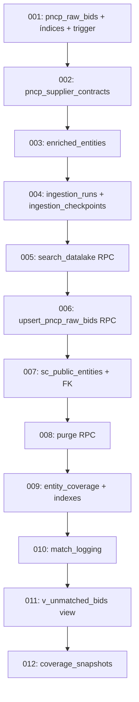
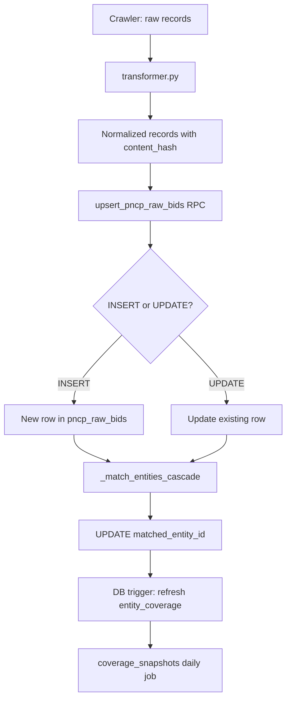

# Fluxograma — Módulo `db`

> Gerado pelo Archaeologist em 2026-07-11T13:00:00Z

---

## Migration Sequence



## Data Flow: Crawl → Upsert → Match → Coverage



## Setup Flow

```mermaid
flowchart LR
    A[setup_db.sh] --> B[Create database pncp_datalake]
    B --> C[Apply 12 migrations in order]
    C --> D[python db/seed/001_sc_entities.py]
    D --> E[Parse Excel: Extra - alvos de licitação.xlsx]
    E --> F[INSERT 2.085 sc_public_entities]
    F --> G[Verify: SELECT count(*)]
```
