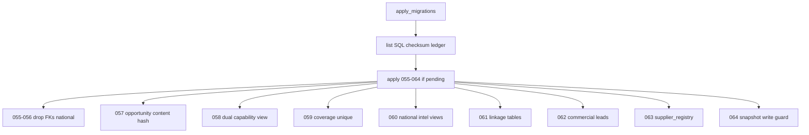

# Flowcharts — `db` / migrations delta

> 🟢 2026-07-28 | HEAD `ffbb9608`

```mermaid
flowchart TD
  A[apply_migrations] --> B[list SQL checksum ledger]
  B --> C[apply 055-064 if pending]
  C --> D[055-056 drop FKs national]
  C --> E[057 opportunity content hash]
  C --> F[058 dual capability view]
  C --> G[059 coverage unique]
  C --> H[060 national intel views]
  C --> I[061 linkage tables]
  C --> J[062 commercial leads]
  C --> K[063 supplier_registry]
  C --> L[064 snapshot write guard]
```
