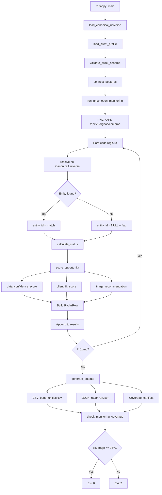
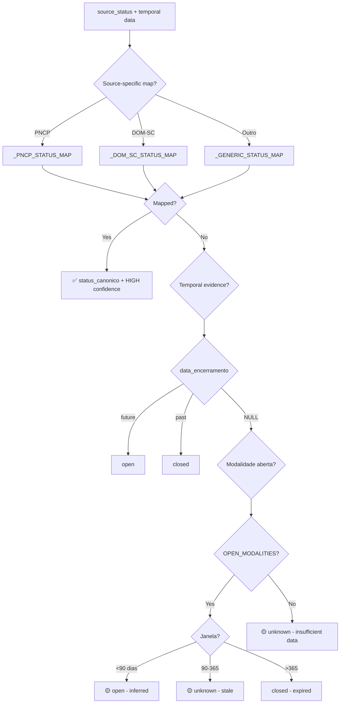
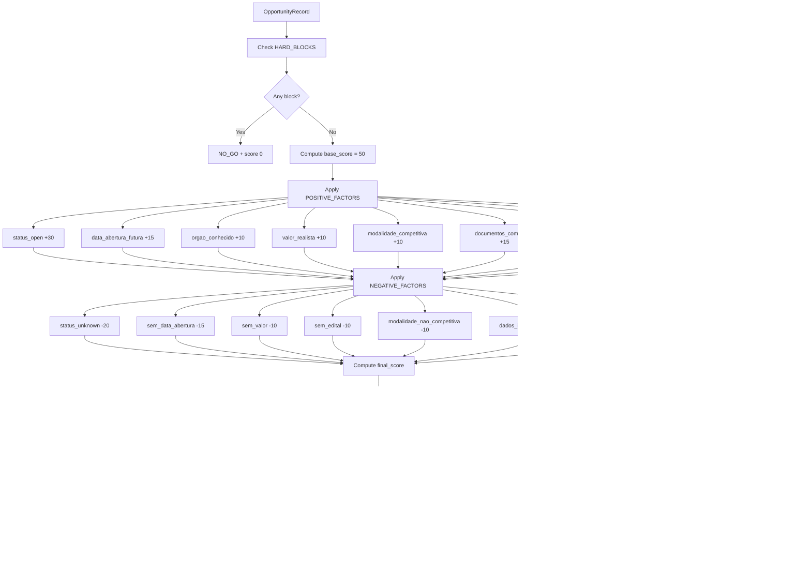
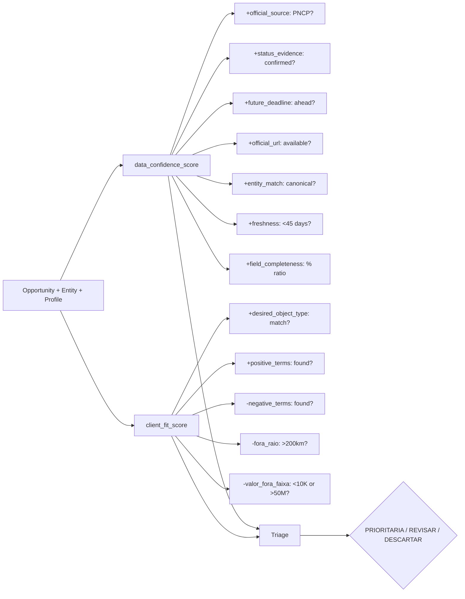

# Fluxograma — Módulo Opportunity Intel

> Gerado pelo Archaeologist em 2026-07-13

## QW-01 Radar Pipeline

```mermaid
flowchart TD
    A[radar.py: main] --> B[load_canonical_universe]
    B --> C[load_client_profile]
    C --> D[validate_qw01_schema]
    D --> E[connect_postgres]

    E --> F[run_pncp_open_monitoring]
    F --> G[PNCP API: /api/v1/orgaos/compras]

    G --> H[Para cada registro]
    H --> I[resolve no CanonicalUniverse]
    I --> J{Entity found?}
    J -->|Yes| K[entity_id = match]
    J -->|No| L[entity_id = NULL + flag]

    K --> M[calculate_status]
    L --> M

    M --> N[score_opportunity]
    N --> O[data_confidence_score]
    N --> P[client_fit_score]
    N --> Q[triage_recommendation]

    O --> R[Build RadarRow]
    P --> R
    Q --> R

    R --> S[Append to results]
    S --> T{Próximo?}
    T -->|Yes| H
    T -->|No| U[generate_outputs]

    U --> V[CSV: opportunities.csv]
    U --> W[JSON: radar-run.json]
    U --> X[Coverage manifest]

    V --> Y[check_monitoring_coverage]
    W --> Y
    X --> Y

    Y --> Z{coverage >= 95%?}
    Z -->|Yes| AA[Exit 0]
    Z -->|No| AB[Exit 2]
```

## Status Canônico

```mermaid
flowchart TD
    A[source_status + temporal data] --> B{Source-specific map?}
    B -->|PNCP| C[_PNCP_STATUS_MAP]
    B -->|DOM-SC| D[_DOM_SC_STATUS_MAP]
    B -->|Outro| E[_GENERIC_STATUS_MAP]

    C --> F{Mapped?}
    D --> F
    E --> F

    F -->|Yes| G[✅ status_canonico + HIGH confidence]
    F -->|No| H{Temporal evidence?}

    H --> I{data_encerramento}
    I -->|future| J[open]
    I -->|past| K[closed]
    I -->|NULL| L{Modalidade aberta?}

    L --> M{OPEN_MODALITIES?}
    M -->|Yes| N{Janela?}
    N -->|<90 dias| O[🟡 open - inferred]
    N -->|90-365| P[🟡 unknown - stale]
    N -->|>365| Q[closed - expired]
    M -->|No| R[🟡 unknown - insufficient data]
```

## Ranking Pipeline

```mermaid
flowchart TD
    A[OpportunityRecord] --> B[Check HARD_BLOCKS]
    B --> C{Any block?}
    C -->|Yes| D[NO_GO + score 0]
    C -->|No| E[Compute base_score = 50]

    E --> F[Apply POSITIVE_FACTORS]
    F --> G[status_open +30]
    F --> H[data_abertura_futura +15]
    F --> I[orgao_conhecido +10]
    F --> J[valor_realista +10]
    F --> K[modalidade_competitiva +10]
    F --> L[documentos_completos +15]
    F --> M[dentro_raio +15]
    F --> N[fonte_confiavel +5]
    F --> O[dados_completos +10]

    G --> P[Apply NEGATIVE_FACTORS]
    H --> P
    I --> P
    J --> P
    K --> P
    L --> P
    M --> P
    N --> P
    O --> P

    P --> Q[status_unknown -20]
    P --> R[sem_data_abertura -15]
    P --> S[sem_valor -10]
    P --> T[sem_edital -10]
    P --> U[modalidade_nao_competitiva -10]
    P --> V[dados_incompletos -15]
    P --> W[publicacao_antiga -5]

    Q --> X[Compute final_score]
    R --> X
    S --> X
    T --> X
    U --> X
    V --> X
    W --> X

    X --> Y{score >= 70?}
    Y -->|Yes| Z[GO]
    Y -->|No| AA{score >= 40?}
    AA -->|Yes| AB[REVIEW]
    AA -->|No| AC[NO_GO]
```

## Scoring (Data Confidence + Client Fit)

```mermaid
flowchart LR
    A[Opportunity + Entity + Profile] --> B[data_confidence_score]

    B --> C[+official_source: PNCP?]
    B --> D[+status_evidence: confirmed?]
    B --> E[+future_deadline: ahead?]
    B --> F[+official_url: available?]
    B --> G[+entity_match: canonical?]
    B --> H[+freshness: <45 days?]
    B --> I[+field_completeness: % ratio]

    A --> J[client_fit_score]
    J --> K[+desired_object_type: match?]
    J --> L[+positive_terms: found?]
    J --> M[-negative_terms: found?]
    J --> N[-fora_raio: >200km?]
    J --> O[-valor_fora_faixa: <10K or >50M?]

    B --> P[Triage]
    J --> P

    P --> Q{PRIORITARIA / REVISAR / DESCARTAR}
```
