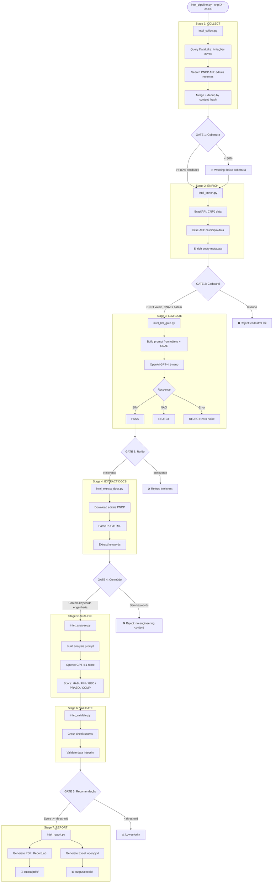
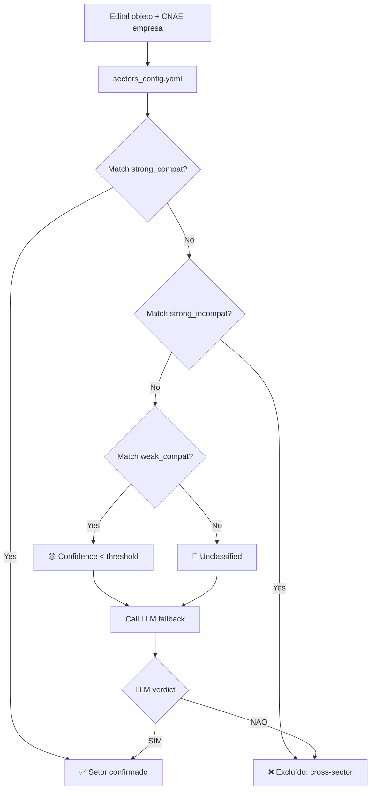

# Fluxograma — Módulo `intel`

> Gerado pelo Archaeologist em 2026-07-11T13:00:00Z

---

## Pipeline de Inteligência (7 stages, 5 gates)

```mermaid
flowchart TD
    START([intel_pipeline.py --cnpj X --ufs SC]) --> S1

    subgraph Stage1 [Stage 1: COLLECT]
        S1[intel_collect.py] --> S1A[Query DataLake: licitações ativas]
        S1A --> S1B[Search PNCP API: editais recentes]
        S1B --> S1C[Merge + dedup by content_hash]
    end

    S1C --> G1{GATE 1: Cobertura}
    G1 -->|>= 80% entidades| S2
    G1 -->|< 80%| WARN1[⚠️ Warning: baixa cobertura]
    WARN1 --> S2

    subgraph Stage2 [Stage 2: ENRICH]
        S2[intel_enrich.py] --> S2A[BrasilAPI: CNPJ data]
        S2A --> S2B[IBGE API: municipio data]
        S2B --> S2C[Enrich entity metadata]
    end

    S2C --> G2{GATE 2: Cadastral}
    G2 -->|CNPJ válido, CNAEs batem| S3
    G2 -->|Inválido| REJECT2[❌ Reject: cadastral fail]

    subgraph Stage3 [Stage 3: LLM GATE]
        S3[intel_llm_gate.py] --> S3A[Build prompt from objeto + CNAE]
        S3A --> S3B[OpenAI GPT-4.1-nano]
        S3B --> S3C{Response}
        S3C -->|SIM| S3D[PASS]
        S3C -->|NAO| S3E[REJECT]
        S3C -->|Error| S3F[REJECT: zero noise]
    end

    S3D --> G3{GATE 3: Ruído}
    G3 -->|Relevante| S4
    G3 -->|Irrelevante| REJECT3[❌ Reject: irrelevant]

    subgraph Stage4 [Stage 4: EXTRACT DOCS]
        S4[intel_extract_docs.py] --> S4A[Download editais PNCP]
        S4A --> S4B[Parse PDF/HTML]
        S4B --> S4C[Extract keywords]
    end

    S4C --> G4{GATE 4: Conteúdo}
    G4 -->|Contém keywords engenharia| S5
    G4 -->|Sem keywords| REJECT4[❌ Reject: no engineering content]

    subgraph Stage5 [Stage 5: ANALYZE]
        S5[intel_analyze.py] --> S5A[Build analysis prompt]
        S5A --> S5B[OpenAI GPT-4.1-nano]
        S5B --> S5C[Score: HAB / FIN / GEO / PRAZO / COMP]
    end

    S5C --> S6

    subgraph Stage6 [Stage 6: VALIDATE]
        S6[intel_validate.py] --> S6A[Cross-check scores]
        S6A --> S6B[Validate data integrity]
    end

    S6B --> G5{GATE 5: Recomendação}
    G5 -->|Score >= threshold| S7
    G5 -->|< threshold| LOW[⚠️ Low priority]

    subgraph Stage7 [Stage 7: REPORT]
        S7[intel_report.py] --> S7A[Generate PDF: ReportLab]
        S7 --> S7B[Generate Excel: openpyxl]
        S7A --> OUTPUT[📄 output/pdfs/]
        S7B --> OUTPUT2[📊 output/excels/]
    end
```

## Sector Classification Flow

```mermaid
flowchart TD
    A[Edital objeto + CNAE empresa] --> B[sectors_config.yaml]
    B --> C{Match strong_compat?}
    C -->|Yes| D[✅ Setor confirmado]
    C -->|No| E{Match strong_incompat?}
    E -->|Yes| F[❌ Excluído: cross-sector]
    E -->|No| G{Match weak_compat?}
    G -->|Yes| H[🟡 Confidence < threshold]
    H --> I[Call LLM fallback]
    I --> J{LLM verdict}
    J -->|SIM| D
    J -->|NAO| F
    G -->|No| K[🔴 Unclassified]
    K --> I
```
