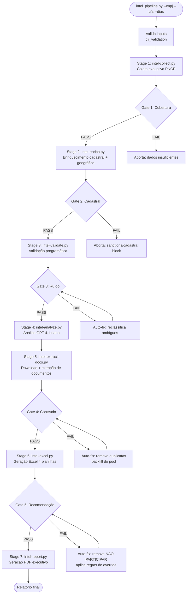
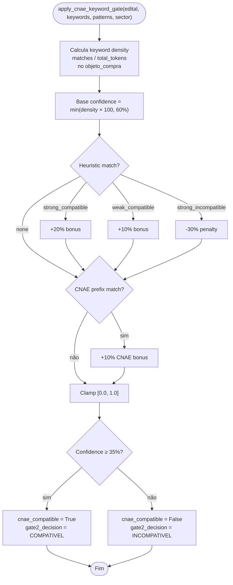
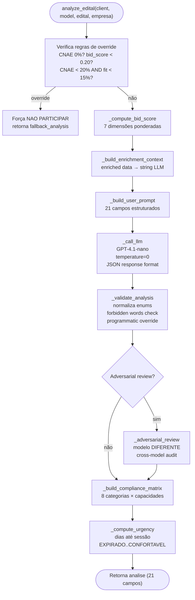

# Fluxograma — Módulo Intel (Pipeline de Inteligência)

> Gerado pelo Archaeologist em 2026-07-11T21:00:00Z
> doc_level: completo
> Base: commit e9729e1

## Pipeline Completo (7 estágios + 5 quality gates)



## Stage 1: Coleta — Fluxo Detalhado

```mermaid
flowchart TD
    START(["intel-collect.py"]) --> PROFILE[1. Profile company<br/>OpenCNPJ: razão, CNAE, capital]
    PROFILE --> SICAF[2. SICAF + Sanctions<br/>Playwright (captcha)<br/>CEIS/CNEP/CEPIM/CEAF]
    SICAF --> MAP_CNAE[3. Map CNAEs → Keywords<br/>setores_config.yaml<br/>agrega keywords]
    MAP_CNAE --> SEARCH_DL{Datalake disponível?}
    SEARCH_DL -->|sim| DL_SEARCH[search_datalake_for_intel<br/>PostgreSQL RPC<br/>< 2s]
    SEARCH_DL -->|não| LIVE_SEARCH[search_pncp_exhaustive<br/>PNCP API live<br/>chunk 14 dias<br/>parallel UF/mod]
    DL_SEARCH --> DEDUP1[4. Cross-portal dedup<br/>SHA-256 hash]
    LIVE_SEARCH --> DEDUP1
    DEDUP1 --> DEDUP2[5. Semantic dedup<br/>Jaccard > 80%<br/>valor ± 15%<br/>mesmo órgão]
    DEDUP2 --> CNAE_GATE[6. CNAE Keyword Gate<br/>probabilístico<br/>threshold 35%]
    CNAE_GATE --> AMBIGUOUS{Confidence < 40%?}
    AMBIGUOUS -->|sim| LLM[7. LLM Fallback<br/>GPT-4.1-nano<br/>SIM/NAO binário]
    AMBIGUOUS -->|não| INTEL
    LLM --> INTEL[8. Competitive Intelligence<br/>HHI, concorrência,<br/>price benchmarks]
    INTEL --> DOCS[9. Document Listings<br/>top 50 editais]
    DOCS --> DELTA[10. Delta Detection<br/>vs análise anterior<br/>NOVO/ATUALIZADO/VENCENDO]
    DELTA --> END(["Retorna {empresa, editais[], metadata}"])
```

## CNAE Keyword Gate (Probabilístico)



## Stage 4: Análise LLM



## Simulação de Lance (bid_simulator.py)

```mermaid
flowchart TD
    START(["simulate_bid(edital, competitive_intel, benchmark, cnae_principal)"]) --> SECTOR[_get_sector<br/>CNAE 2-digit → margens setoriais]
    SECTOR --> COMPETITORS{Competitive intel disponível?}
    COMPETITORS -->|HHI > 0| EFF_N["N_eff = 1/HHI × 1.5<br/>clamp [2, 20]"]
    COMPETITORS -->|label only| LABEL_N["BAIXA=8, MODERADA=5<br/>ALTA=3, MUITO_ALTA=2"]
    COMPETITORS -->|não| DEFAULT_N["Default N = 5"]
    EFF_N --> DISCOUNT
    LABEL_N --> DISCOUNT
    DEFAULT_N --> DISCOUNT

    DISCOUNT[Calcula desconto ótimo<br/>sugerido = median + 0.3σ<br/>capped: 1.0 - margem_mínima]
    DISCOUNT --> P_WIN[P vitória<br/>z = (discount - median) / std<br/>CDF logístico × (N-1) competidores<br/>clamp [0.02, 0.95]]
    P_WIN --> MARGIN[Margem = BDI setorial - desconto<br/>Valor esperado = P × margem × valor]
    MARGIN --> CONFIANÇA{Histórico ≥ 3 contratos?}
    CONFIANÇA -->|sim, baixa std| ALTA["confianca = ALTA"]
    CONFIANÇA -->|sim, alta std| MEDIA["confianca = MEDIA"]
    CONFIANÇA -->|não| BAIXA["confianca = INSUFICIENTE"]
    ALTA --> END(["Retorna BidSimulation"])
    MEDIA --> END
    BAIXA --> END
```
