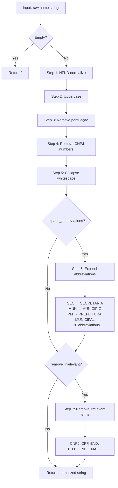
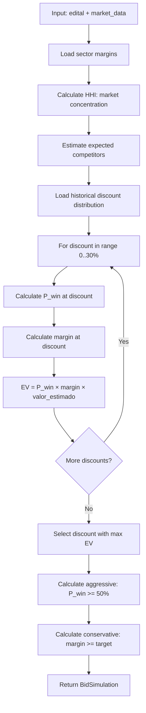
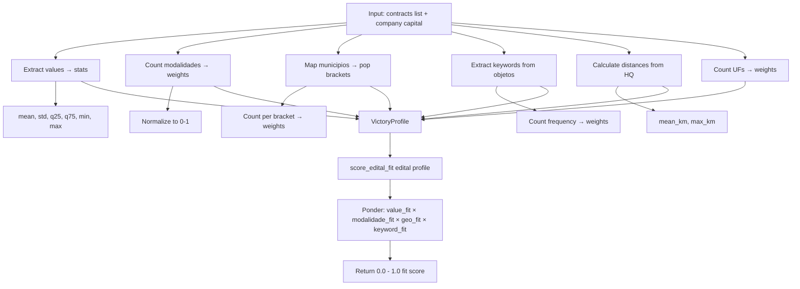

# Fluxograma — Módulo `lib`

> Gerado pelo Archaeologist em 2026-07-11T13:00:00Z

---

## Name Normalizer Pipeline

```mermaid
flowchart TD
    A[Input: raw name string] --> B{Empty?}
    B -->|Yes| C[Return '']
    B -->|No| D[Step 1: NFKD normalize]
    D --> E[Step 2: Uppercase]
    E --> F[Step 3: Remove pontuação]
    F --> G[Step 4: Remove CNPJ numbers]
    G --> H[Step 5: Collapse whitespace]
    H --> I{expand_abbreviations?}
    I -->|Yes| J[Step 6: Expand abbreviations]
    J --> K[SEC → SECRETARIA<br>MUN → MUNICIPIO<br>PM → PREFEITURA MUNICIPAL<br>...18 abbreviations]
    I -->|No| L
    K --> L{remove_irrelevant?}
    L -->|Yes| M[Step 7: Remove irrelevant terms]
    M --> N[CNPJ, CPF, END, TELEFONE, EMAIL...]
    L -->|No| O
    N --> O[Return normalized string]
```

## Bid Simulator

```mermaid
flowchart TD
    A[Input: edital + market_data] --> B[Load sector margins]
    B --> C[Calculate HHI: market concentration]
    C --> D[Estimate expected competitors]
    D --> E[Load historical discount distribution]
    E --> F[For discount in range 0..30%]
    F --> G[Calculate P_win at discount]
    G --> H[Calculate margin at discount]
    H --> I[EV = P_win × margin × valor_estimado]
    I --> J{More discounts?}
    J -->|Yes| F
    J -->|No| K[Select discount with max EV]
    K --> L[Calculate aggressive: P_win >= 50%]
    L --> M[Calculate conservative: margin >= target]
    M --> N[Return BidSimulation]
```

## Victory Profile Builder

```mermaid
flowchart TD
    A[Input: contracts list + company capital] --> B[Extract values → stats]
    B --> C[mean, std, q25, q75, min, max]
    A --> D[Count modalidades → weights]
    D --> E[Normalize to 0-1]
    A --> F[Map municipios → pop brackets]
    F --> G[Count per bracket → weights]
    A --> H[Extract keywords from objetos]
    H --> I[Count frequency → weights]
    A --> J[Calculate distances from HQ]
    J --> K[mean_km, max_km]
    A --> L[Count UFs → weights]
    B --> M[VictoryProfile]
    D --> M
    F --> M
    H --> M
    J --> M
    L --> M
    M --> N[score_edital_fit edital profile]
    N --> O[Ponder: value_fit × modalidade_fit × geo_fit × keyword_fit]
    O --> P[Return 0.0 - 1.0 fit score]
```
