# Fluxograma — Módulo Lib

> Gerado pelo Archaeologist em 2026-07-11T21:00:00Z
> doc_level: completo
> Base: commit e9729e1

## Name Normalizer

```mermaid
flowchart TD
    START(["normalize_name(name, expand_abbreviations=True)"]) --> NFKD[NFKD normalize<br/>Unicode → ASCII<br/>remove acentos]
    NFKD --> UPPER[Uppercase]
    UPPER --> PUNCT[Remove pontuação<br/>regex: &#91;^\w\s&#93;]
    PUNCT --> CNPJ[Remove CNPJ numbers<br/>8-14 digit sequences]
    CNPJ --> SPACE[Collapse whitespace]
    SPACE --> EXPAND{expand_abbreviations?}
    EXPAND -->|sim| ABBREV[Expande 18 abreviaturas<br/>word-boundary regex<br/>longest-first ordering]
    EXPAND -->|não| IRRELEVANT
    ABBREV --> IRRELEVANT{remove_irrelevant?}
    IRRELEVANT -->|sim| STRIP[Remove termos de contato<br/>CNPJ, CPF, END, CEP,<br/>FONE, TELEFONE, EMAIL,<br/>SITE, HTTP, HTTPS, WWW]
    IRRELEVANT -->|não| END
    STRIP --> END(["Retorna nome normalizado"])
```



## Victory Profile — Build + Score

```mermaid
flowchart TD
    START(["build_victory_profile(contracts, capital, ufs)"]) --> STATS[Estatísticas de valor<br/>mean, std, q25, q75, min, max]
    STATS --> MOD[Modalidade weights<br/>frequência relativa]
    MOD --> POP[População brackets<br/>micro|pequeno|medio|grande|metropole]
    POP --> KW[Keyword frequency<br/>min 2 ocorrências<br/>top 50]
    KW --> DIST[Distância mean + max]
    DIST --> UF[UF weights<br/>frequência relativa]
    UF --> PROFILE(["VictoryProfile"])

    PROFILE --> SCORE_START(["score_edital_fit(edital, profile)"])
    SCORE_START --> V["Valor (30%):<br/>Gaussian z-score fit<br/>penaliza > 3× max"]
    V --> K["Keyword (25%):<br/>weighted Jaccard overlap<br/>edital kw ∩ profile kw"]
    K --> M["Modalidade (15%):<br/>direct frequency lookup"]
    M --> G["Geografia (15%):<br/>UF weight × distance penalty<br/>>2× mean → 0.5"]
    G --> P["População (15%):<br/>bracket frequency lookup"]
    P --> SUM["Soma ponderada<br/>0.0-1.0"]
    SUM --> LABEL{"Score?"}
    LABEL -->|"≥ 0.7"| EXCEL["Excellent fit"]
    LABEL -->|"≥ 0.5"| GOOD["Good fit"]
    LABEL -->|"≥ 0.3"| MODERATE["Moderate fit"]
    LABEL -->|"< 0.3"| POOR["Poor fit"]
```

## Cost Estimator

```mermaid
flowchart TD
    START(["estimate_proposal_cost(distancia_km, duracao_h, is_capital, is_eletronico)"]) --> ELETRONICO{is_eletronico?}
    ELETRONICO -->|sim| MIN_COST["Custo mínimo: R$ 600<br/>tempo de preparo"]
    MIN_COST --> VISITA{Visita técnica?<br/>dist > 200km}
    VISITA -->|sim| ADD_KM["+ R$ 2/km ida e volta"]
    VISITA -->|não| ROI_CALC
    ADD_KM --> ROI_CALC

    ELETRONICO -->|não| DESLOC["Deslocamento:<br/>dist × 2 × R$ 0.80/km"]
    DESLOC --> HOSP{Distância > 200km?}
    HOSP -->|sim, >500km| HOSP2["2 diárias<br/>capital: R$ 280<br/>interior: R$ 180"]
    HOSP -->|sim, ≤500km| HOSP1["1 diária"]
    HOSP -->|não| ALIM
    HOSP1 --> ALIM[Alimentação<br/>per diem: R$ 80]
    HOSP2 --> ALIM
    ALIM --> PEDAGIO[Pedágio<br/>5 faixas: R$ 0-250<br/>× 2 ida/volta]
    PEDAGIO --> TECNICO[Tempo técnico:<br/>(viagem + sessão) × R$ 150/h]
    TECNICO --> FIXO[Custos fixos<br/>proposta + mobilização]

    FIXO --> ROI_CALC[estimate_roi_simple<br/>ratio = valor / custo]
    ROI_CALC --> CLASS{"ratio?"}
    CLASS -->|"≥ 500"| EXC["EXCELENTE"]
    CLASS -->|"≥ 100"| BOM["BOM"]
    CLASS -->|"≥ 30"| MOD["MODERADO"]
    CLASS -->|"≥ 10"| MARG["MARGINAL"]
    CLASS -->|"< 10"| DESF["DESFAVORAVEL"]
```

## Doc Templates — Structured Extraction

```mermaid
flowchart TD
    START(["extract_structured(text, doc_type)"]) --> DETECT[detect_doc_type<br/>título + filename<br/>→ EDITAL|TERMO_REFERENCIA|PLANILHA]
    DETECT --> PATTERNS[Carrega patterns<br/>por doc_type]
    PATTERNS --> LOOP{"Para cada field"}
    LOOP --> REGEX["Tenta regex patterns<br/>confidence = 1.0 - (i × 0.15)<br/>floor 0.3"]
    REGEX --> MATCH{"Match?"}
    MATCH -->|sim| SET["ExtractedField(found=True, value, confidence)"]
    MATCH -->|não| NEXT
    SET --> NEXT{"Próximo field?"}
    NEXT -->|sim| LOOP
    NEXT -->|não| RESULT["StructuredExtraction<br/>{doc_type, fields[], completeness_pct}"]
    RESULT --> END(["Fim"])
```
