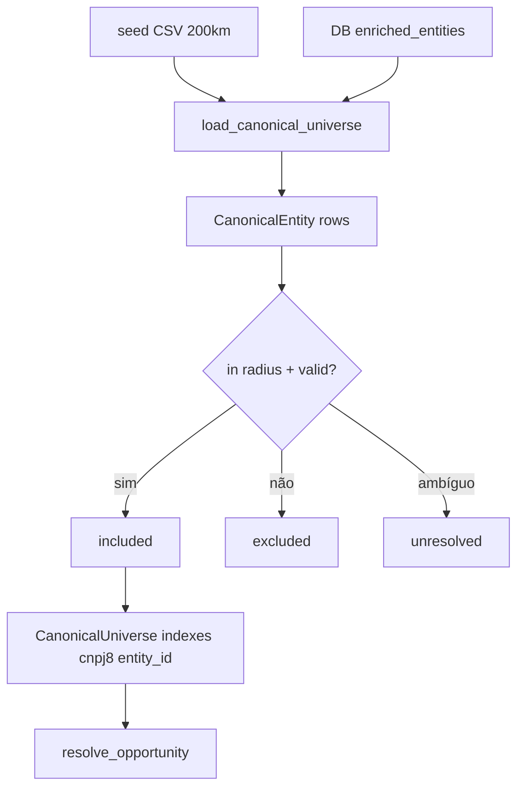
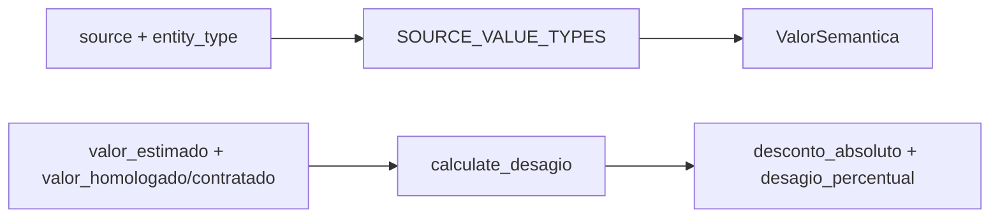

# Flowcharts — módulo `lib`

> 🟢 CONFIRMADO — 2026-07-17

## 1. Canonical universe

```mermaid
flowchart TD
    A[seed CSV 200km] --> B[load_canonical_universe]
    C[DB enriched_entities] --> B
    B --> D[CanonicalEntity rows]
    D --> E{in radius + valid?}
    E -->|sim| F[included]
    E -->|não| G[excluded]
    E -->|ambíguo| H[unresolved]
    F --> I[CanonicalUniverse indexes cnpj8 entity_id]
    I --> J[resolve_opportunity]
```

## 2. Value semantics / deságio

```mermaid
flowchart LR
    A[source + entity_type] --> B[SOURCE_VALUE_TYPES]
    B --> C[ValorSemantica]
    D[valor_estimado + valor_homologado/contratado] --> E[calculate_desagio]
    E --> F[desconto_absoluto + desagio_percentual]
```
