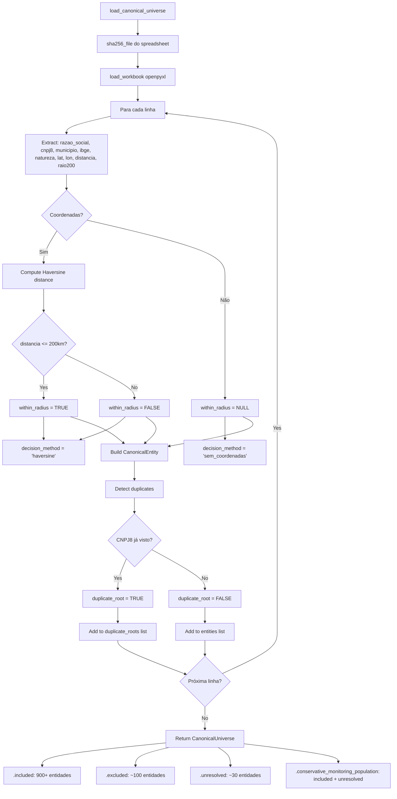
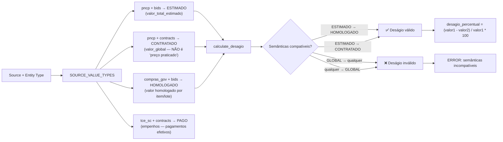
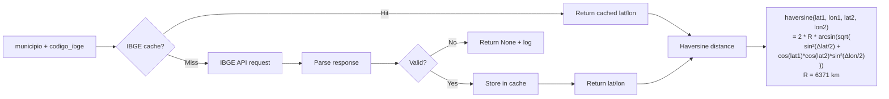
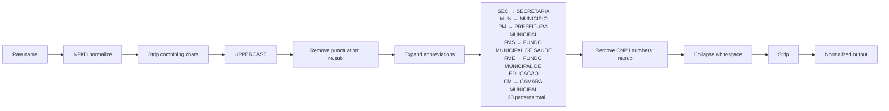

# Fluxograma — Módulo Lib

> Gerado pelo Archaeologist em 2026-07-13

## CanonicalUniverse Resolution

```mermaid
flowchart TD
    A[load_canonical_universe] --> B[sha256_file do spreadsheet]
    B --> C[load_workbook openpyxl]

    C --> D[Para cada linha]
    D --> E[Extract: razao_social, cnpj8, municipio, ibge, natureza, lat, lon, distancia, raio200]
    E --> F{Coordenadas?}

    F -->|Sim| G[Compute Haversine distance]
    G --> H{distancia <= 200km?}
    H -->|Yes| I[within_radius = TRUE]
    H -->|No| J[within_radius = FALSE]

    F -->|Não| K[within_radius = NULL]
    K --> L[decision_method = 'sem_coordenadas']

    I --> M[decision_method = 'haversine']
    J --> M

    I --> N[Build CanonicalEntity]
    J --> N
    K --> N

    N --> O[Detect duplicates]
    O --> P{CNPJ8 já visto?}
    P -->|Yes| Q[duplicate_root = TRUE]
    P -->|No| R[duplicate_root = FALSE]

    Q --> S[Add to duplicate_roots list]
    R --> T[Add to entities list]

    S --> U{Próxima linha?}
    T --> U
    U -->|Yes| D
    U -->|No| V[Return CanonicalUniverse]

    V --> W[.included: 900+ entidades]
    V --> X[.excluded: ~100 entidades]
    V --> Y[.unresolved: ~30 entidades]
    V --> Z[.conservative_monitoring_population: included + unresolved]
```

## Value Semantics Pipeline

```mermaid
flowchart LR
    A[Source + Entity Type] --> B[SOURCE_VALUE_TYPES]

    B --> C["pncp + bids → ESTIMADO\n(valor_total_estimado)"]
    B --> D["pncp + contracts → CONTRATADO\n(valor_global — NÃO é 'preço praticado')"]
    B --> E["compras_gov + bids → HOMOLOGADO\n(valor homologado por item/lote)"]
    B --> F["tce_sc + contracts → PAGO\n(empenhos — pagamentos efetivos)"]

    C --> G[calculate_desagio]
    D --> G
    E --> G

    G --> H{Semânticas compatíveis?}
    H -->|ESTIMADO → HOMOLOGADO| I[✅ Deságio válido]
    H -->|ESTIMADO → CONTRATADO| I
    H -->|GLOBAL → qualquer| J[❌ Deságio inválido]
    H -->|qualquer → GLOBAL| J

    I --> K["desagio_percentual = (valor1 - valor2) / valor1 * 100"]
    J --> L[ERROR: semânticas incompatíveis]
```

## Geocode Pipeline

```mermaid
flowchart LR
    A[municipio + codigo_ibge] --> B{IBGE cache?}
    B -->|Hit| C[Return cached lat/lon]
    B -->|Miss| D[IBGE API request]

    D --> E[Parse response]
    E --> F{Valid?}
    F -->|Yes| G[Store in cache]
    F -->|No| H[Return None + log]

    G --> I[Return lat/lon]

    C --> J[Haversine distance]
    I --> J

    J --> K["haversine(lat1, lon1, lat2, lon2)\n= 2 * R * arcsin(sqrt(\n  sin²(Δlat/2) + cos(lat1)*cos(lat2)*sin²(Δlon/2)\n))\nR = 6371 km"]
```

## Name Normalizer Pipeline

```mermaid
flowchart LR
    A[Raw name] --> B[NFKD normalize]
    B --> C[Strip combining chars]
    C --> D[UPPERCASE]
    D --> E[Remove punctuation: re.sub]
    E --> F[Expand abbreviations]

    F --> G["SEC → SECRETARIA\nMUN → MUNICIPIO\nPM → PREFEITURA MUNICIPAL\nFMS → FUNDO MUNICIPAL DE SAUDE\nFME → FUNDO MUNICIPAL DE EDUCACAO\nCM → CAMARA MUNICIPAL\n... 20 patterns total"]

    G --> H[Remove CNPJ numbers: re.sub]
    H --> I[Collapse whitespace]
    I --> J[Strip]
    J --> K[Normalized output]
```
