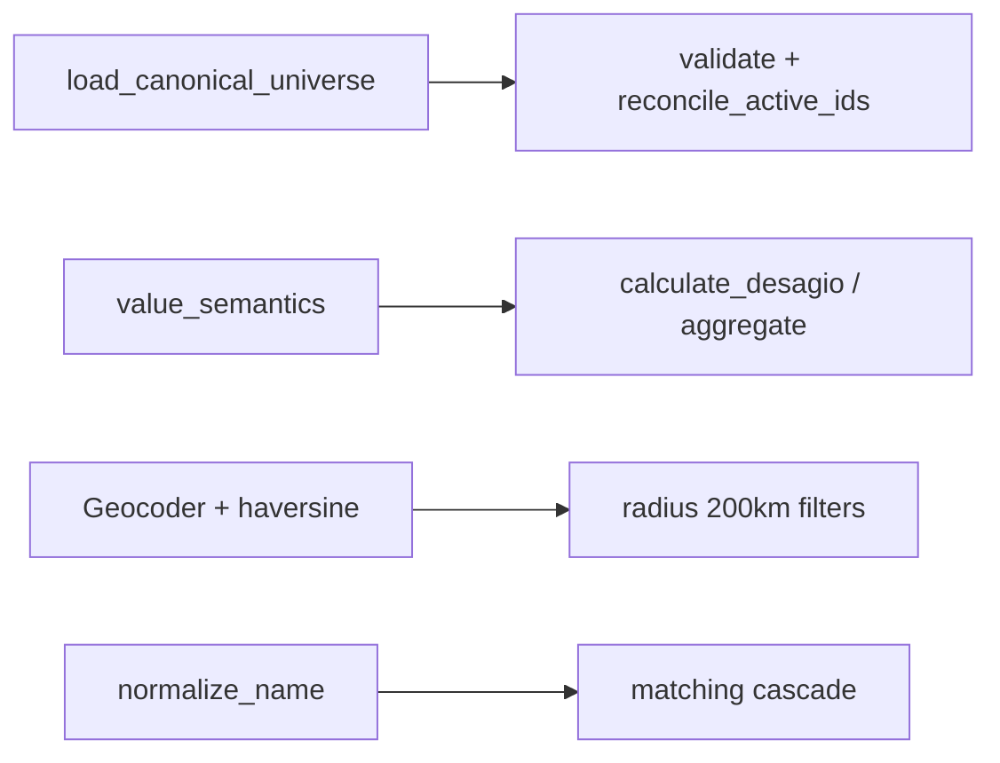

# Flowcharts — `lib`

> 🟢 2026-07-28 | HEAD `ffbb9608`

```mermaid
flowchart LR
  U[load_canonical_universe] --> V[validate + reconcile_active_ids]
  VS[value_semantics] --> D[calculate_desagio / aggregate]
  G[Geocoder + haversine] --> R[radius 200km filters]
  N[normalize_name] --> M[matching cascade]
```
