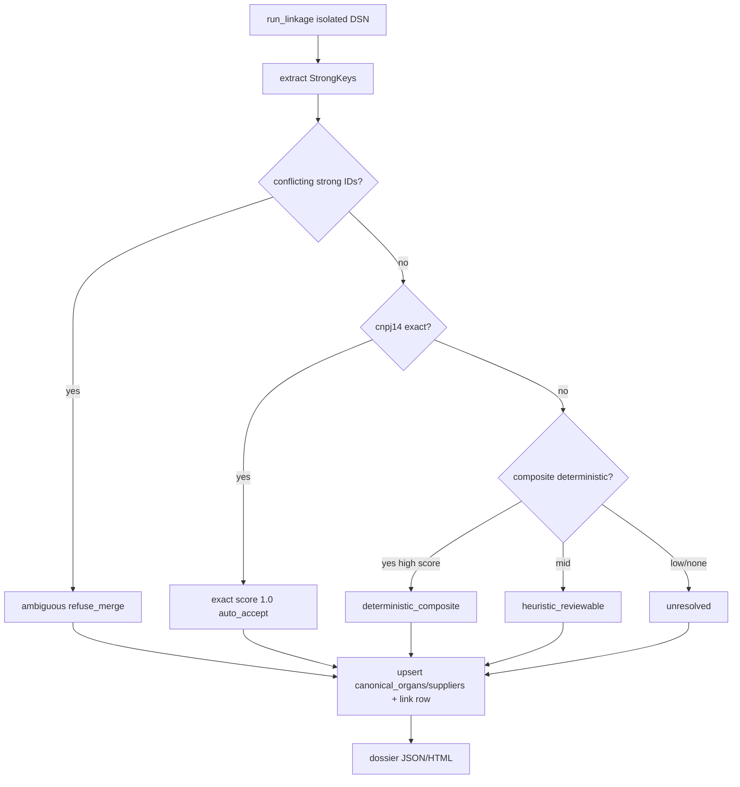

# Flowcharts — `linkage`

> 🟢 2026-07-28 | HEAD `ffbb9608`

```mermaid
flowchart TD
  A[run_linkage isolated DSN] --> B[extract StrongKeys]
  B --> C{conflicting strong IDs?}
  C -->|yes| D[ambiguous refuse_merge]
  C -->|no| E{cnpj14 exact?}
  E -->|yes| F[exact score 1.0 auto_accept]
  E -->|no| G{composite deterministic?}
  G -->|yes high score| H[deterministic_composite]
  G -->|mid| I[heuristic_reviewable]
  G -->|low/none| J[unresolved]
  F --> K[upsert canonical_organs/suppliers + link row]
  H --> K
  I --> K
  D --> K
  J --> K
  K --> L[dossier JSON/HTML]
```
