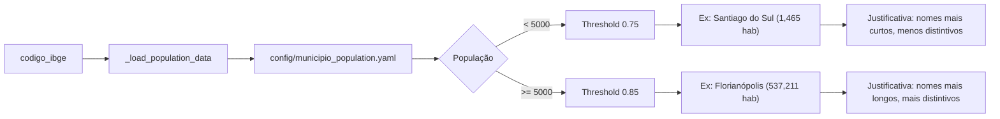
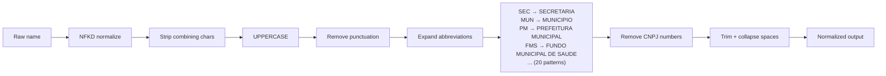

# Fluxograma — Módulo Matching

> Gerado pelo Archaeologist em 2026-07-13

## Entity Matching Cascade — 3 Níveis

```mermaid
flowchart TD
    A[Input: orgao_cnpj + orgao_nome + municipio + codigo_ibge] --> B[Nível 1: CNPJ Exact]

    B --> C[Extract CNPJ8 = digits[:8]]
    C --> D[Query: SELECT FROM sc_public_entities WHERE cnpj_8 = CNPJ8]
    D --> E{Found?}

    E -->|1 match| F[✅ CONFIRMED — confidence: HIGH]
    E -->|>1 match| G[⚠️ Ambiguous — choose closest municipio match]
    E -->|0 matches| H[Nível 2: Name + Municipio]

    G --> F

    H --> I[Normalize orgao_nome]
    I --> J["normalize_name(): NFKD → UPPER → strip accents → expand abbreviations → remove punctuation → trim"]
    J --> K[Normalize municipio]
    K --> L[Query: WHERE normalized_name = X AND municipio = Y]
    L --> M{Found?}

    M -->|1 match| N[✅ CONFIRMED — confidence: HIGH]
    M -->|>1 match| O[⚠️ Ambiguous — fallback to fuzzy]
    M -->|0 matches| P[Nível 2b: Alias Matching]

    P --> Q[Apply siglas + patterns]
    Q --> R["Ex: 'PM DE X' ↔ 'PREFEITURA MUNICIPAL DE X'"]
    R --> S[Query with alias-expanded names]
    S --> T{Found?}

    T -->|Yes| U[✅ CONFIRMED — confidence: HIGH]
    T -->|No| V[Nível 3: Fuzzy Matching]

    V --> W[Get fuzzy threshold for municipio]
    W --> X["_get_fuzzy_threshold(codigo_ibge)"]
    X --> Y{População}
    Y -->|< 5000 hab| Z[Threshold = 0.75]
    Y -->|>= 5000 hab| AA[Threshold = 0.85]

    Z --> AB[rapidfuzz.fuzz.ratio]
    AA --> AB
    AB --> AC{Score >= threshold?}

    AC -->|Yes > 0.90| AD[✅ Matched — confidence: HIGH]
    AC -->|Yes 0.85-0.90| AE[⚠️ Matched — confidence: MEDIUM]
    AC -->|Yes 0.75-0.85| AF[⚠️ Matched — confidence: LOW]
    AC -->|No| AG[❌ No match — entity UNRESOLVED]

    O --> AB
```

## Fuzzy Threshold por População



## Name Normalizer Pipeline


