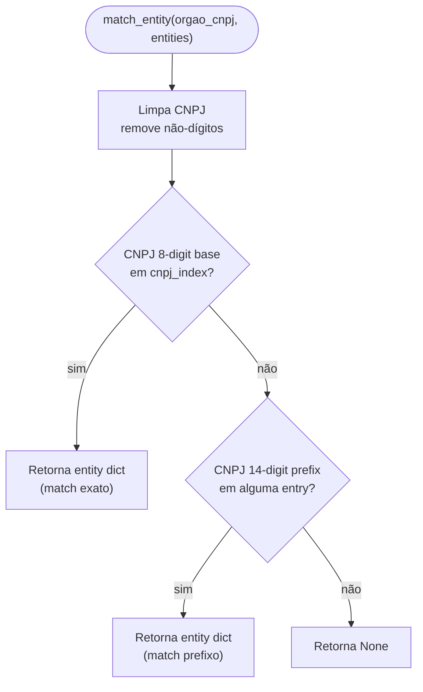
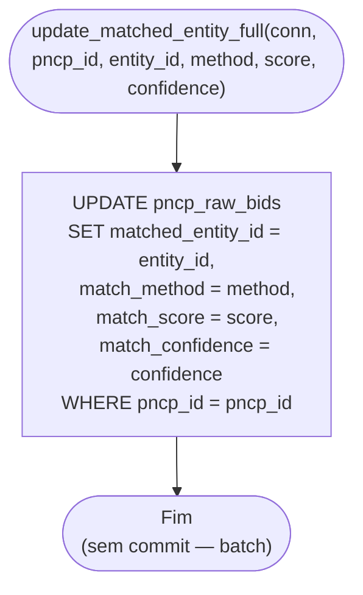

# Fluxograma — Módulo Matching

> Gerado pelo Archaeologist em 2026-07-11T21:00:00Z
> doc_level: completo
> Base: commit e9729e1

## Entity Matching Cascade (3 níveis)

```mermaid
flowchart TD
    START(["match_entities_cascade(conn, source, entities)"]) --> FETCH[Busca bids unmatched<br/>SELECT * FROM pncp_raw_bids<br/>WHERE matched_entity_id IS NULL<br/>AND source = p_source]
    FETCH --> BUILD[Constrói 3 índices in-memory]
    BUILD --> IDX1["cnpj_index: dict[str, dict]<br/>key = cnpj_8 (8 digitos base)"]
    IDX1 --> IDX2["name_exact_index: dict[str, dict]<br/>key = normalize_name(razao_social)"]
    IDX2 --> IDX3["name_muni_index: dict[tuple, dict]<br/>key = (normalize_name, codigo_ibge)"]
    IDX3 --> LOOP{"Para cada bid sem match"}

    LOOP --> LV1{"orgao_cnpj preenchido<br/>E no cnpj_index?"}
    LV1 -->|sim| MATCH1["match_method = 'cnpj'<br/>match_score = 1.0<br/>match_confidence = 'high'"]
    LV1 -->|não| NM["normalize_name(orgao_razao_social)"]

    NM --> LV2{"(nm, codigo_ibge)<br/>em name_muni_index?"}
    LV2 -->|sim| MATCH2["match_method = 'name_normalized'<br/>match_score = 1.0<br/>match_confidence = 'high'"]
    LV2 -->|não| LV2B{"nm em<br/>name_exact_index?"}
    LV2B -->|sim| MATCH2

    LV2B -->|não| LV3[Fuzzy Matching]
    LV3 --> FILTER{"codigo_ibge disponível?"}
    FILTER -->|sim| CANDIDATES["Filtra all_entities_norm<br/>WHERE codigo_ibge = bid.ibge<br/>reduz espaço de busca"]
    FILTER -->|não| ALL["Todos os all_entities_norm"]
    CANDIDATES --> FUZZ
    ALL --> FUZZ["Para cada candidato:<br/>score = fuzz_ratio(nm, candidate._normalized_name)<br/>rapidfuzz (preferido) ou difflib"]
    FUZZ --> BEST["Seleciona max(score)<br/>acima de ENTITY_MATCH_FUZZY_THRESHOLD<br/>(default: 0.85)"]
    BEST --> TIER{"Melhor score?"}
    TIER -->|"score ≥ 0.95"| HIGH["match_method = 'fuzzy'<br/>match_confidence = 'high'"]
    TIER -->|"score ≥ 0.85"| MED["match_method = 'fuzzy'<br/>match_confidence = 'medium'"]
    TIER -->|"< 0.85"| NONE["match_method = 'unmatched'<br/>match_score = 0.0<br/>matched_entity_id = NULL"]

    MATCH1 --> UPDATE
    MATCH2 --> UPDATE
    HIGH --> UPDATE
    MED --> UPDATE
    NONE --> UPDATE

    UPDATE["UPDATE pncp_raw_bids SET<br/>matched_entity_id = entity.id,<br/>match_method = ...,<br/>match_score = ...,<br/>match_confidence = ...<br/>WHERE pncp_id = bid.pncp_id"]

    UPDATE --> COUNT[Incrementa contador<br/>stats[method] += 1]
    COUNT --> NEXT{"Próximo bid?"}
    NEXT -->|sim| LOOP
    NEXT -->|não| COMMIT["conn.commit()<br/>transação única"]
    COMMIT --> RETURN["Retorna stats:<br/>{cnpj, name_normalized,<br/>fuzzy, unmatched, total}"]
    RETURN --> END(["Fim"])
```

## Função: match_entity (single-entity lookup)



## Função: update_matched_entity_full


