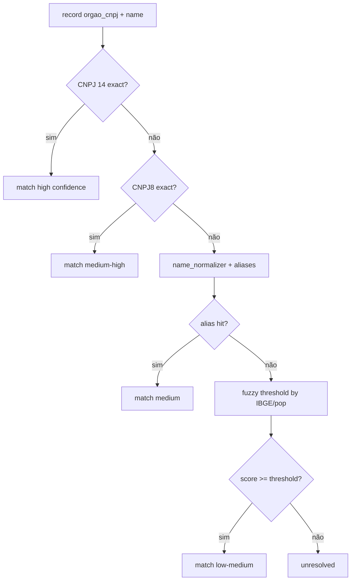
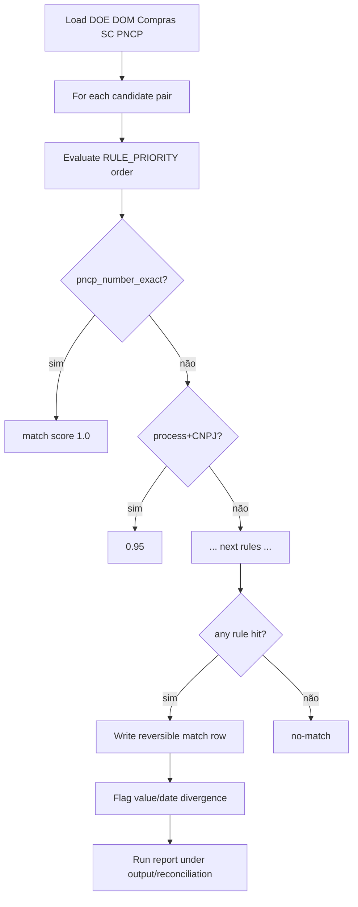

# Flowcharts — módulo `matching`

> 🟢 CONFIRMADO — 2026-07-17

## 1. Entity match cascade

```mermaid
flowchart TD
    A[record orgao_cnpj + name] --> B{CNPJ 14 exact?}
    B -->|sim| C[match high confidence]
    B -->|não| D{CNPJ8 exact?}
    D -->|sim| E[match medium-high]
    D -->|não| F[name_normalizer + aliases]
    F --> G{alias hit?}
    G -->|sim| H[match medium]
    G -->|não| I[fuzzy threshold by IBGE/pop]
    I --> J{score >= threshold?}
    J -->|sim| K[match low-medium]
    J -->|não| L[unresolved]
```

## 2. Official acts reconcile (deterministic)

```mermaid
flowchart TD
    A[Load DOE DOM Compras SC PNCP] --> B[For each candidate pair]
    B --> C[Evaluate RULE_PRIORITY order]
    C --> D{pncp_number_exact?}
    D -->|sim| E[match score 1.0]
    D -->|não| F{process+CNPJ?}
    F -->|sim| G[0.95]
    F -->|não| H[... next rules ...]
    H --> I{any rule hit?}
    I -->|sim| J[Write reversible match row]
    I -->|não| K[no-match]
    J --> L[Flag value/date divergence]
    L --> M[Run report under output/reconciliation]
```
