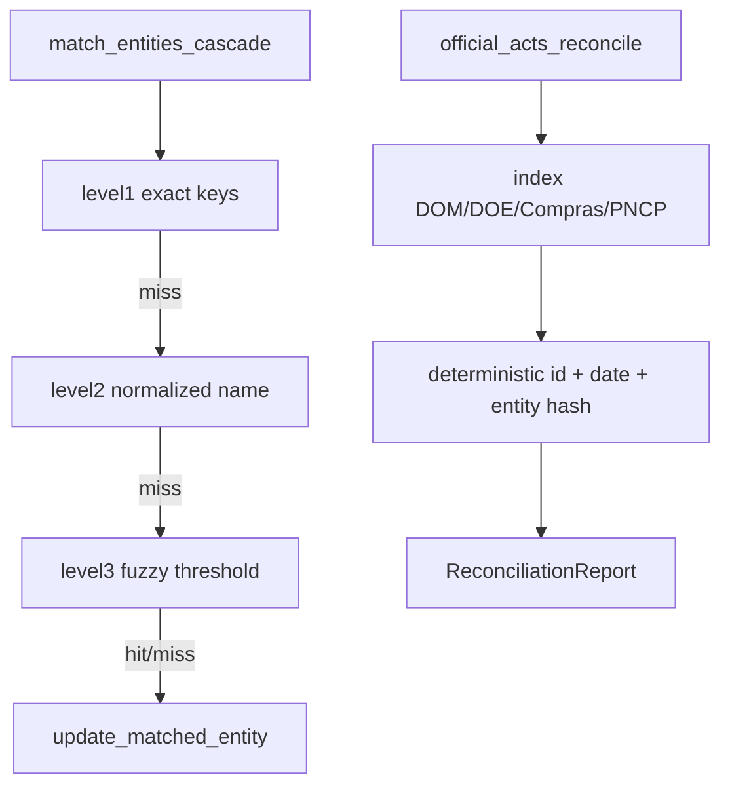

# Flowcharts — `matching`

> 🟢 2026-07-28 | HEAD `ffbb9608`

```mermaid
flowchart TD
  A[match_entities_cascade] --> B[level1 exact keys]
  B -->|miss| C[level2 normalized name]
  C -->|miss| D[level3 fuzzy threshold]
  D -->|hit/miss| E[update_matched_entity]
  F[official_acts_reconcile] --> G[index DOM/DOE/Compras/PNCP]
  G --> H[deterministic id + date + entity hash]
  H --> I[ReconciliationReport]
```
