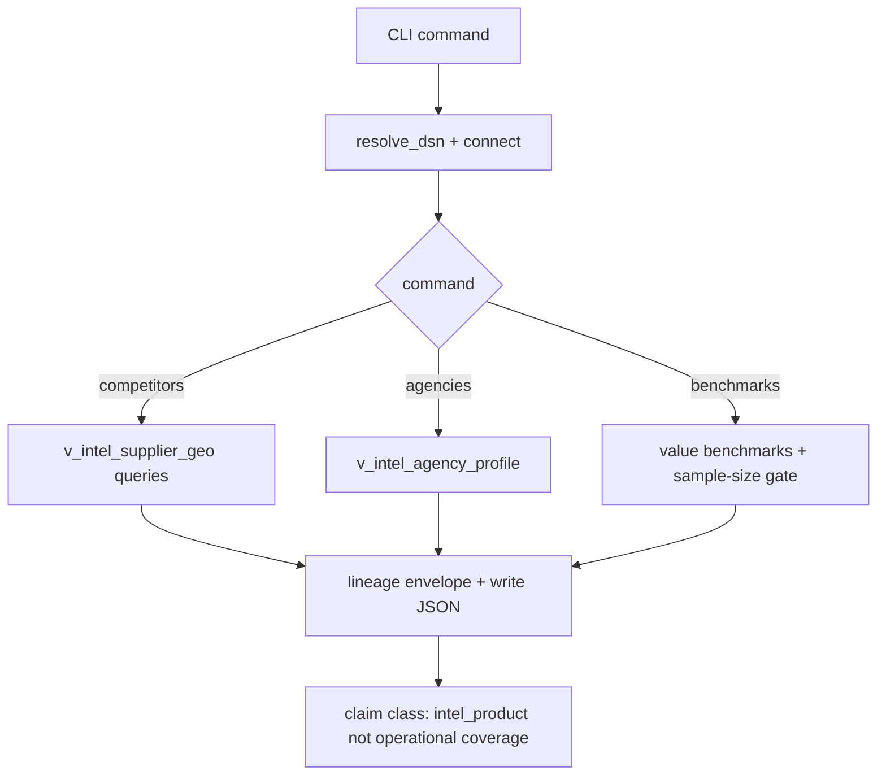

# Flowcharts — `national_intel`

> 🟢 2026-07-28 | HEAD `ffbb9608`

```mermaid
flowchart TD
  A[CLI command] --> B[resolve_dsn + connect]
  B --> C{command}
  C -->|competitors| D[v_intel_supplier_geo queries]
  C -->|agencies| E[v_intel_agency_profile]
  C -->|benchmarks| F[value benchmarks + sample-size gate]
  D --> G[lineage envelope + write JSON]
  E --> G
  F --> G
  G --> H[claim class: intel_product not operational coverage]
```
