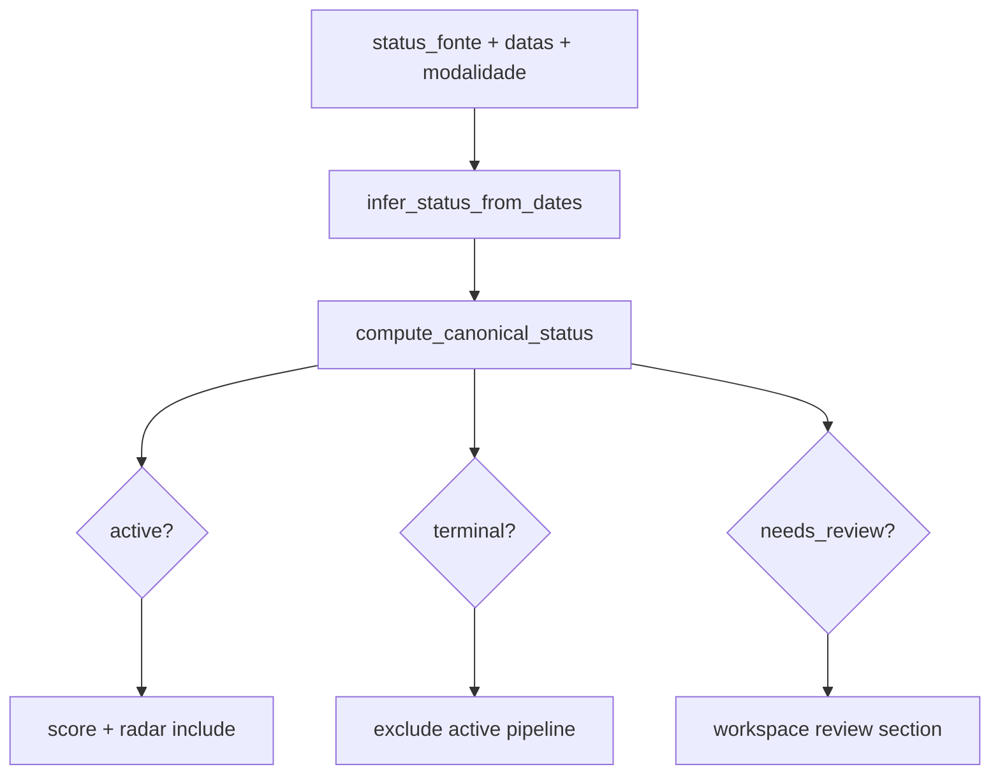
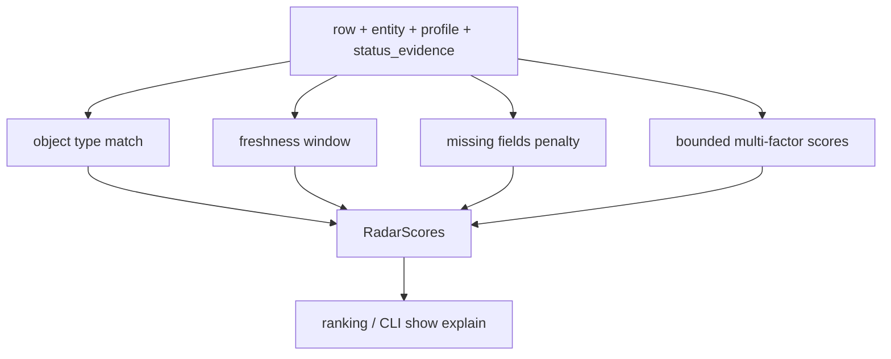

# Flowcharts — módulo `opportunity_intel`

> 🟢 CONFIRMADO — 2026-07-17

## 1. Status canônico

```mermaid
flowchart TD
    A[status_fonte + datas + modalidade] --> B[infer_status_from_dates]
    B --> C[compute_canonical_status]
    C --> D{active?}
    C --> E{terminal?}
    C --> F{needs_review?}
    D --> G[score + radar include]
    E --> H[exclude active pipeline]
    F --> I[workspace review section]
```

## 2. Scoring

```mermaid
flowchart TD
    A[row + entity + profile + status_evidence] --> B[object type match]
    A --> C[freshness window]
    A --> D[missing fields penalty]
    A --> E[bounded multi-factor scores]
    B --> F[RadarScores]
    C --> F
    D --> F
    E --> F
    F --> G[ranking / CLI show explain]
```
