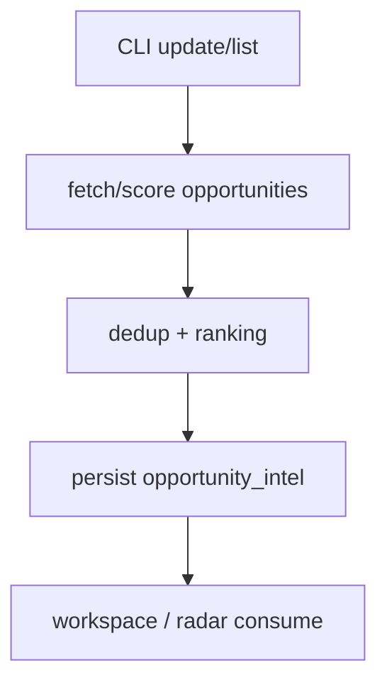

# Flowcharts — `opportunity_intel`

> 🟢 refresh 2026-07-28 | superfície estável

```mermaid
flowchart TD
  A[CLI update/list] --> B[fetch/score opportunities]
  B --> C[dedup + ranking]
  C --> D[persist opportunity_intel]
  D --> E[workspace / radar consume]
```
