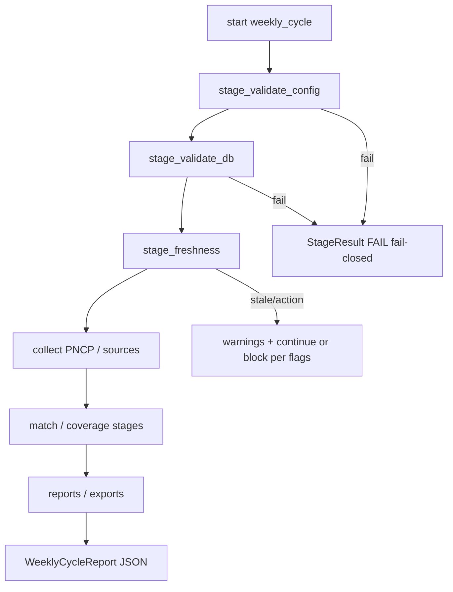
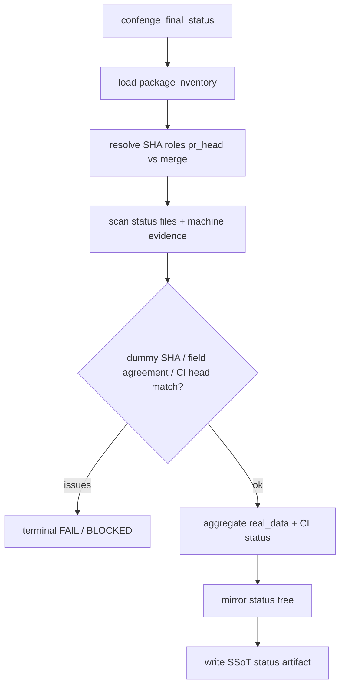
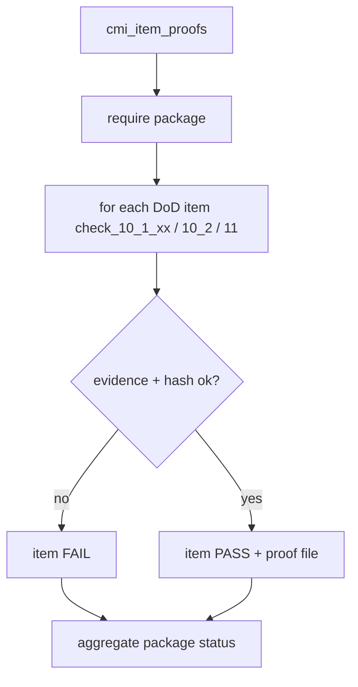
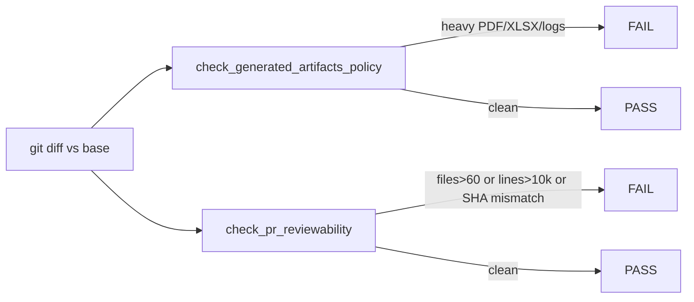

# Flowcharts — `ops`

> 🟢 Extraído do código | 2026-07-28 | HEAD `ffbb9608`

## 1. Weekly cycle (resumo)

```mermaid
flowchart TD
  A[start weekly_cycle] --> B[stage_validate_config]
  B --> C[stage_validate_db]
  C --> D[stage_freshness]
  D --> E[collect PNCP / sources]
  E --> F[match / coverage stages]
  F --> G[reports / exports]
  G --> H[WeeklyCycleReport JSON]
  B -->|fail| X[StageResult FAIL fail-closed]
  C -->|fail| X
  D -->|stale/action| W[warnings + continue or block per flags]
```

## 2. CONFENGE terminal status

```mermaid
flowchart TD
  A[confenge_final_status] --> B[load package inventory]
  B --> C[resolve SHA roles pr_head vs merge]
  C --> D[scan status files + machine evidence]
  D --> E{dummy SHA / field agreement / CI head match?}
  E -->|issues| F[terminal FAIL / BLOCKED]
  E -->|ok| G[aggregate real_data + CI status]
  G --> H[mirror status tree]
  H --> I[write SSoT status artifact]
```

## 3. CMI item proofs

```mermaid
flowchart TD
  A[cmi_item_proofs] --> B[require package]
  B --> C[for each DoD item check_10_1_xx / 10_2 / 11]
  C --> D{evidence + hash ok?}
  D -->|no| E[item FAIL]
  D -->|yes| F[item PASS + proof file]
  E --> G[aggregate package status]
  F --> G
```

## 4. PR / artifact gates

```mermaid
flowchart LR
  PR[git diff vs base] --> A[check_generated_artifacts_policy]
  PR --> B[check_pr_reviewability]
  A -->|heavy PDF/XLSX/logs| F1[FAIL]
  B -->|files>60 or lines>10k or SHA mismatch| F2[FAIL]
  A -->|clean| OK1[PASS]
  B -->|clean| OK2[PASS]
```
