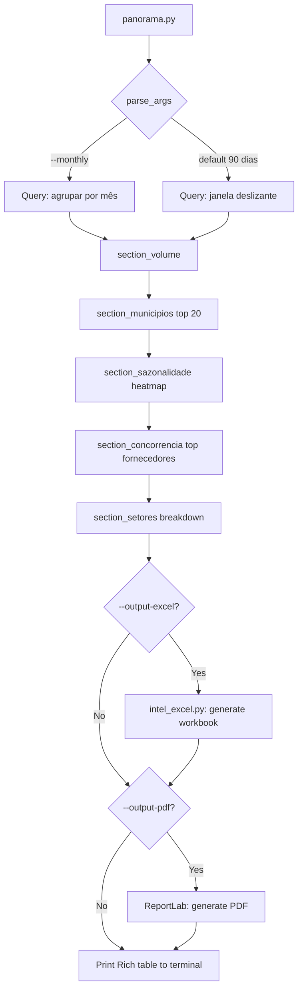
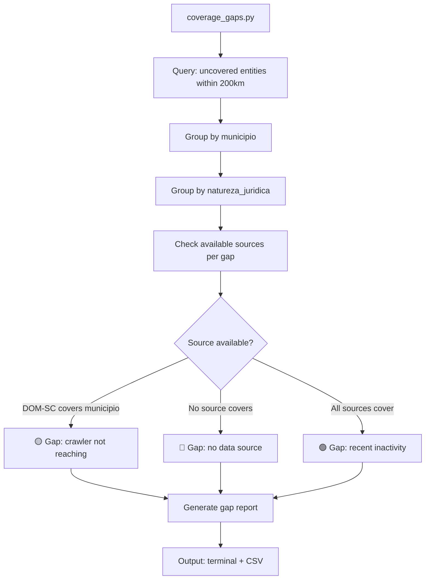
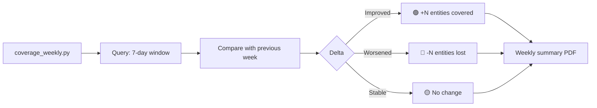

# Fluxograma — Módulo `reports`

> Gerado pelo Archaeologist em 2026-07-11T13:00:00Z

---

## Panorama de Mercado

```mermaid
flowchart TD
    A[panorama.py] --> B{parse_args}
    B -->|--monthly| C[Query: agrupar por mês]
    B -->|default 90 dias| D[Query: janela deslizante]
    C --> E[section_volume]
    D --> E
    E --> F[section_municipios top 20]
    F --> G[section_sazonalidade heatmap]
    G --> H[section_concorrencia top fornecedores]
    H --> I[section_setores breakdown]
    I --> J{--output-excel?}
    J -->|Yes| K[intel_excel.py: generate workbook]
    J -->|No| L
    K --> L{--output-pdf?}
    L -->|Yes| M[ReportLab: generate PDF]
    L -->|No| N[Print Rich table to terminal]
    M --> N
```

## Coverage Gap Detection

```mermaid
flowchart TD
    A[coverage_gaps.py] --> B[Query: uncovered entities within 200km]
    B --> C[Group by municipio]
    C --> D[Group by natureza_juridica]
    D --> E[Check available sources per gap]
    E --> F{Source available?}
    F -->|DOM-SC covers municipio| G[🟡 Gap: crawler not reaching]
    F -->|No source covers| H[🔴 Gap: no data source]
    F -->|All sources cover| I[🟢 Gap: recent inactivity]
    G --> J[Generate gap report]
    H --> J
    I --> J
    J --> K[Output: terminal + CSV]
```

## Coverage Weekly Report

```mermaid
flowchart LR
    A[coverage_weekly.py] --> B[Query: 7-day window]
    B --> C[Compare with previous week]
    C --> D{Delta}
    D -->|Improved| E[🟢 +N entities covered]
    D -->|Worsened| F[🔴 -N entities lost]
    D -->|Stable| G[🟡 No change]
    E --> H[Weekly summary PDF]
    F --> H
    G --> H
```
