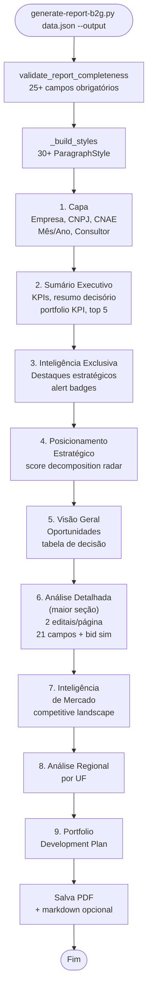
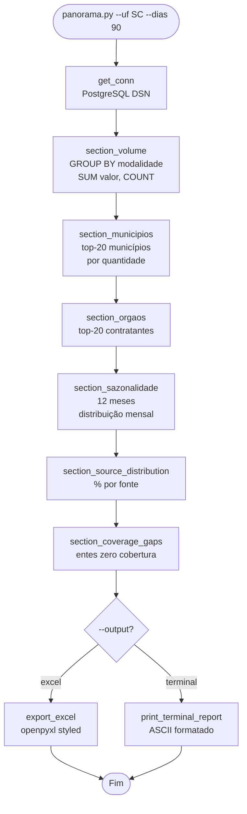

# Fluxograma — Módulo Reports

> Gerado pelo Archaeologist em 2026-07-11T21:00:00Z
> doc_level: completo
> Base: commit e9729e1

## Coverage Weekly — Geração de Relatório

```mermaid
flowchart TD
    START(["coverage_weekly.py --date YYYY-MM-DD"]) --> SNAP[generate_snapshot(date)<br/>chama generate_coverage_snapshot()]
    SNAP --> FETCH[fetch_coverage_data<br/>7 categorias:]
    FETCH --> CAT1[1. summary: cobertura por source]
    CAT1 --> CAT2[2. gaps: entes sem cobertura]
    CAT2 --> CAT3[3. gaps_by_municipio: agregado]
    CAT3 --> CAT4[4. gaps_by_natureza: natureza jurídica]
    CAT4 --> CAT5[5. trend: 4-week com LAG]
    CAT5 --> CAT6[6. total_entities: base]
    CAT6 --> CAT7[7. date_range: período]
    CAT7 --> PDF{--format?}
    PDF -->|pdf| GEN_PDF[generate_pdf<br/>reportlab Big Four]
    PDF -->|excel| GEN_XLS[generate_excel<br/>openpyxl 4 sheets]
    GEN_PDF --> COVER[_build_cover_page<br/>bronze rule<br/>week number]
    COVER --> KPI[_build_kpi_section<br/>covered/total/uncovered<br/>coverage %]
    KPI --> SOURCE[_build_source_table<br/>por fonte: total, covered, %]
    SOURCE --> GAPS[_build_top_gaps<br/>top-10 municípios<br/>com mais gaps]
    GAPS --> TREND[_build_trend_section<br/>4 semanas<br/>setas ↑↓→]
    TREND --> RECS[_build_recommendations<br/>4 regras de negócio]
    RECS --> SAVE[Salva PDF + Excel<br/>data/output/]
    GEN_XLS --> SAVE
    SAVE --> END(["Fim"])
```

## B2G Report — Estrutura do PDF (generate-report-b2g.py)



## Semantic Dedup (report_dedup.py)

```mermaid
flowchart TD
    START(["semantic_dedup(editais, jaccard_threshold=0.85, warning_threshold=0.75)"]) --> PASS1[Pass 1: Exact ID match<br/>composite key:<br/>cnpj_orgao|ano|sequencial]
    PASS1 --> REMOVE1[Remove duplicates<br/>exact_removed += 1]
    REMOVE1 --> PASS2[Pass 2: Semantic Jaccard]
    PASS2 --> NORM["normalize_for_dedup(objeto)<br/>NFKD → lowercase<br/>remove punctuation<br/>filter stopwords (55+)"]
    NORM --> PAIRS{"Para cada par<br/>mesma UF"}
    PAIRS --> JACCARD["jaccard_similarity(tokens_a, tokens_b)<br/>intersection / union"]
    JACCARD --> CHECK{"Score?"}
    CHECK -->|"≥ 0.85"| REMOVE2[Remove duplicate<br/>semantic_removed += 1]
    CHECK -->|"0.75-0.85"| WARN[Warning: grey zone<br/>semantic_warnings += 1]
    CHECK -->|"< 0.75"| KEEP[Keep both]
    REMOVE2 --> NEXT{"Próximo par?"}
    WARN --> NEXT
    KEEP --> NEXT
    NEXT -->|sim| PAIRS
    NEXT -->|não| STATS["Retorna (deduped_list, stats)<br/>{exact_removed, semantic_removed,<br/>candidates_evaluated, warnings}"]
    STATS --> END(["Fim"])
```

## Panorama — Estrutura do Relatório


