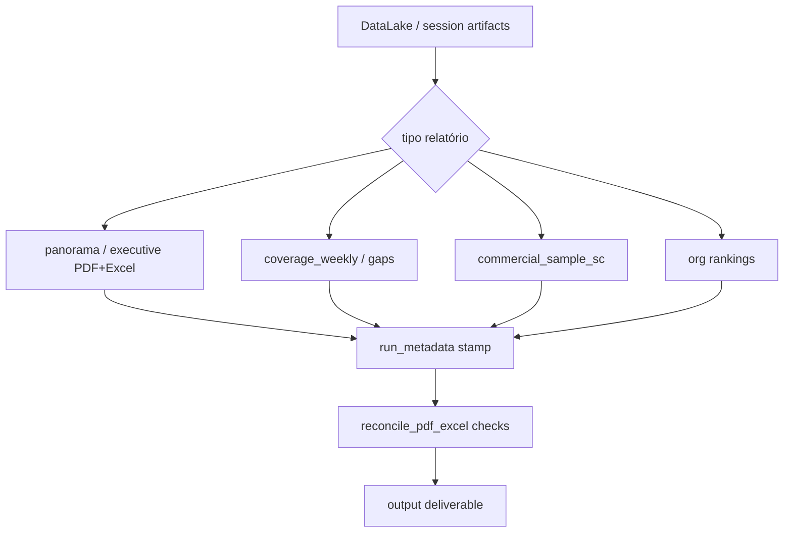

# Flowcharts — módulo `reports`

> 🟢 CONFIRMADO — 2026-07-17

```mermaid
flowchart TD
    A[DataLake / session artifacts] --> B{tipo relatório}
    B --> C[panorama / executive PDF+Excel]
    B --> D[coverage_weekly / gaps]
    B --> E[commercial_sample_sc]
    B --> F[org rankings]
    C --> G[run_metadata stamp]
    D --> G
    E --> G
    F --> G
    G --> H[reconcile_pdf_excel checks]
    H --> I[output deliverable]
```
