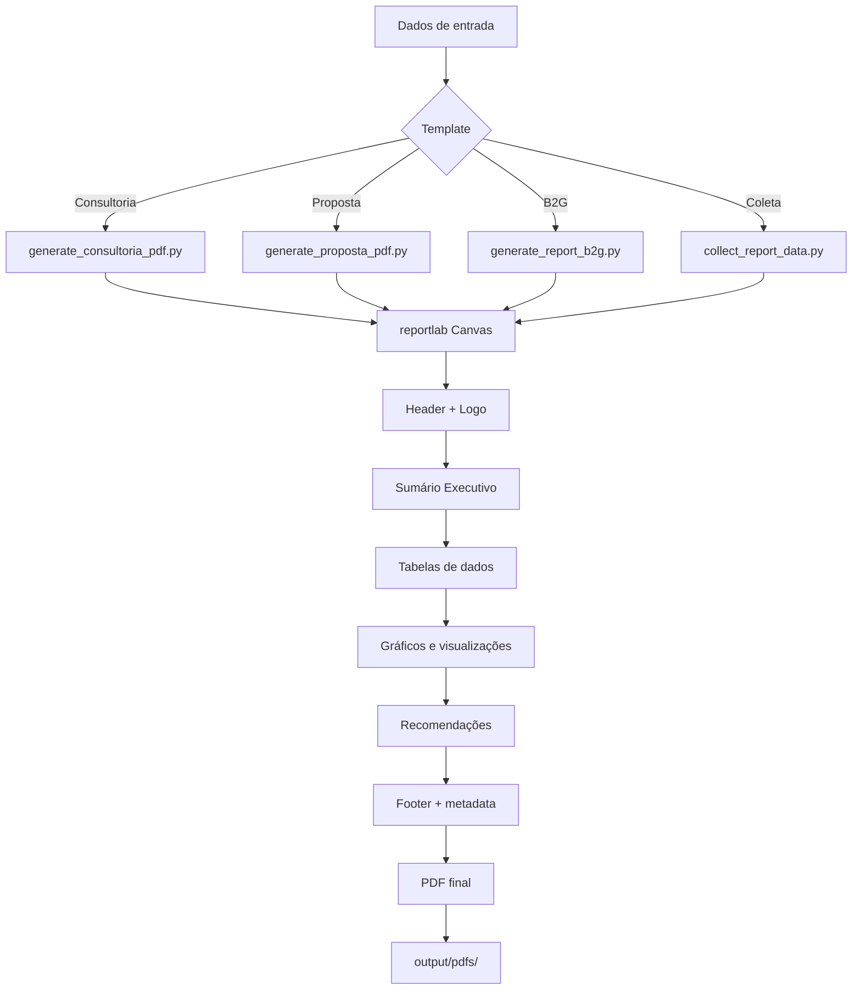
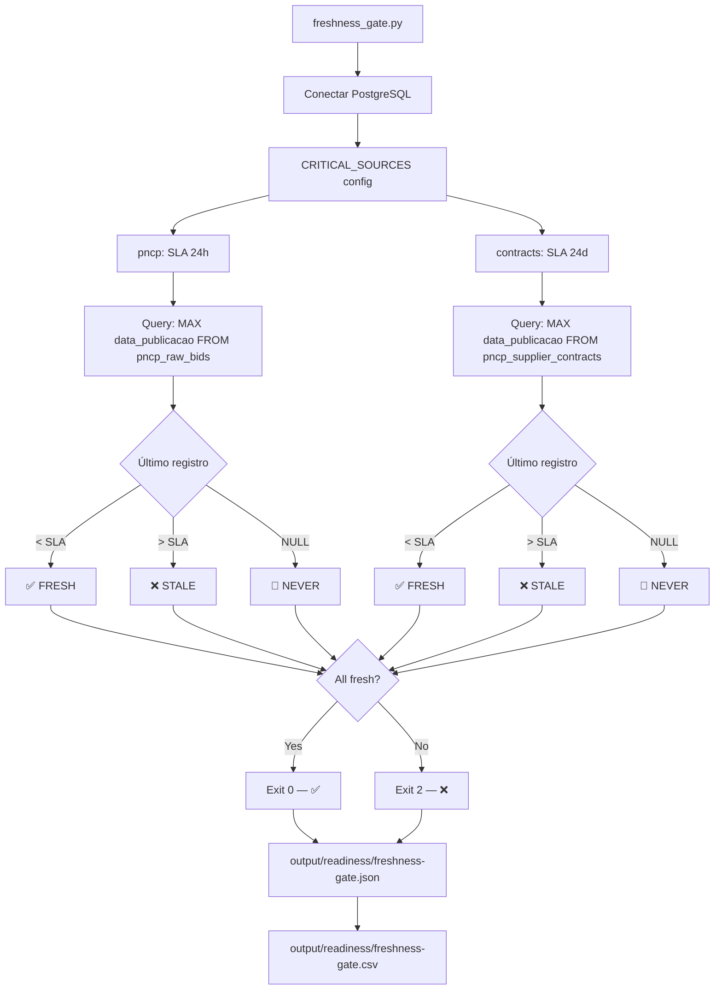

# Fluxograma — Módulo Reports

> Gerado pelo Archaeologist em 2026-07-13

## Relatório Semanal de Cobertura

```mermaid
flowchart TD
    A[coverage_weekly.py] --> B[Conectar PostgreSQL]
    B --> C[Query: entity_coverage + evidence]

    C --> D[Para cada fonte]
    D --> E[Calcular % cobertura]
    E --> F[Agrupar por município]
    F --> G[Agrupar por natureza jurídica]

    G --> H[Gerar PDF: reportlab]
    G --> I[Gerar Excel: openpyxl]

    H --> J[Gráficos: barras, pizza, linha temporal]
    I --> K[Abas: resumo, por fonte, por município, gaps]

    J --> L[output/reports/coverage-semanal-{date}.pdf]
    K --> M[output/reports/coverage-semanal-{date}.xlsx]
```

## Panorama Setorial

```mermaid
flowchart LR
    A[panorama.py] --> B[Query sectors_config.yaml]
    B --> C[13 setores B2G]

    C --> D[Para cada setor]
    D --> E[Filtrar licitações por keywords]
    E --> F[Agrupar: modalidade, valor, região]
    F --> G[Calcular market share]

    G --> H[PDF/Excel executivo]
    H --> I[output/reports/panorama-{date}.pdf]
```

## Pipeline de Geração PDF (Big Four)



## Freshness Gate


