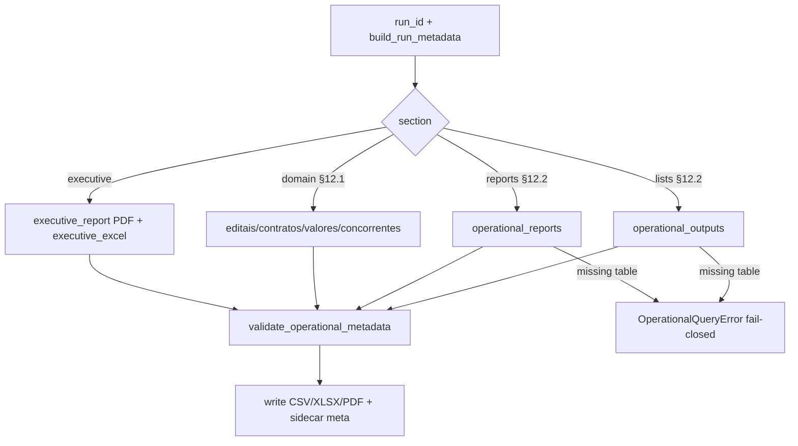

# Flowcharts — `reports` (ORPT)

> 🟢 2026-07-28 | HEAD `ffbb9608`

## Operational pack

```mermaid
flowchart TD
  A[run_id + build_run_metadata] --> B{section}
  B -->|lists §12.2| C[operational_outputs]
  B -->|reports §12.2| D[operational_reports]
  B -->|domain §12.1| E[editais/contratos/valores/concorrentes]
  B -->|executive| F[executive_report PDF + executive_excel]
  C --> G[validate_operational_metadata]
  D --> G
  E --> G
  F --> G
  G --> H[write CSV/XLSX/PDF + sidecar meta]
  C -->|missing table| X[OperationalQueryError fail-closed]
  D -->|missing table| X
```
