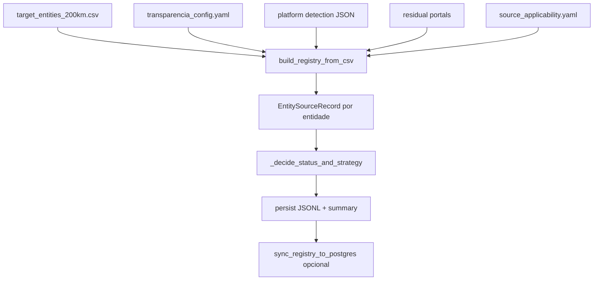
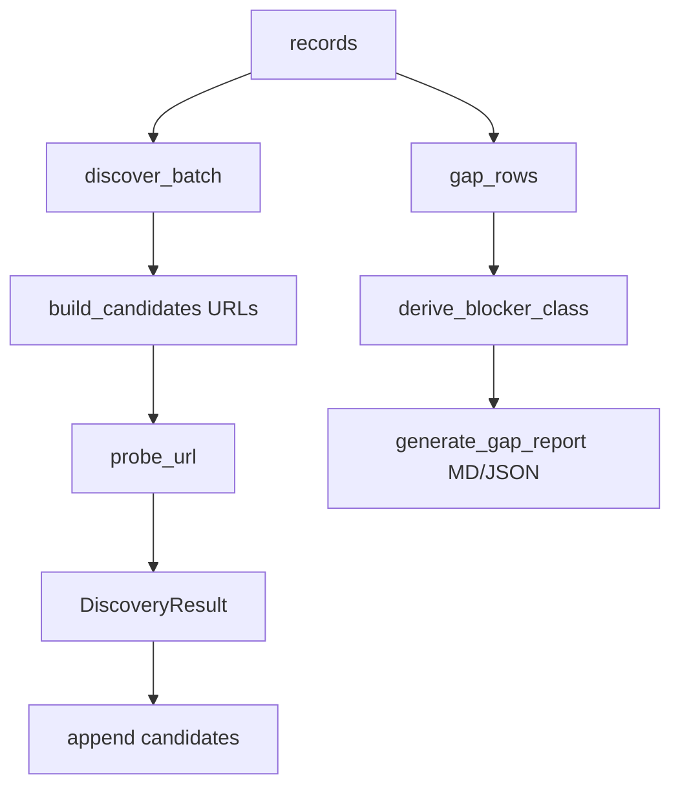
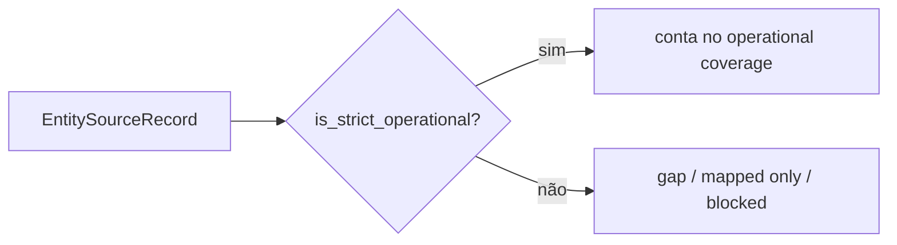

# Flowcharts — módulo `source_registry`

> 🟢 CONFIRMADO — 2026-07-17

## 1. Build registry 1093

```mermaid
flowchart TD
    A[target_entities_200km.csv] --> B[build_registry_from_csv]
    C[transparencia_config.yaml] --> B
    D[platform detection JSON] --> B
    E[residual portals] --> B
    F[source_applicability.yaml] --> B
    B --> G[EntitySourceRecord por entidade]
    G --> H[_decide_status_and_strategy]
    H --> I[persist JSONL + summary]
    I --> J[sync_registry_to_postgres opcional]
```

## 2. Discovery + gaps

```mermaid
flowchart TD
    A[records] --> B[discover_batch]
    B --> C[build_candidates URLs]
    C --> D[probe_url]
    D --> E[DiscoveryResult]
    E --> F[append candidates]
    A --> G[gap_rows]
    G --> H[derive_blocker_class]
    H --> I[generate_gap_report MD/JSON]
```

## 3. Strict operational

```mermaid
flowchart LR
    A[EntitySourceRecord] --> B{is_strict_operational?}
    B -->|sim| C[conta no operational coverage]
    B -->|não| D[gap / mapped only / blocked]
```
